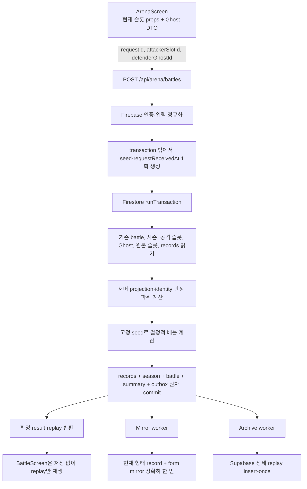

# 아레나 Ghost 시스템 최종 구현 계획

- 문서 상태: 도메인 설계 승인, 구현 기준선
- 작성일: 2026-07-18
- 적용 대상: Firebase 로그인 사용자의 비동기 아레나 PvP
- 구현 기본값: `현재 형태 전적 + 불변 Ghost 방어 스냅샷` 혼합형
- 출시 원칙: 전체 수직 경로가 준비될 때까지 기능 플래그 비활성

## 1. 최종 결론

아레나 Ghost는 등록 당시 모습을 보존하는 **불변 방어 캐릭터**다. 현재 슬롯의 디지몬이 진화하거나 사망해도 Ghost는 자동 삭제되거나 다른 디지몬으로 바뀌지 않는다.

예를 들어 슬롯 4의 엔젤몬을 Ghost로 등록한 뒤 현재 디지몬이 스컬그레이몬으로 진화하면 다음과 같이 동작한다.

- 현재 디지몬 영역에는 최신 props의 스컬그레이몬이 표시된다.
- 내 Ghost 목록에는 등록 당시 엔젤몬이 그대로 남는다.
- 엔젤몬 Ghost의 `formRecordMirror`는 진화 직전 값에서 영구 고정된다.
- 엔젤몬 Ghost의 `ownDefenseRecord`는 이후에도 해당 Ghost가 방어할 때마다 계속 증가한다.
- 스컬그레이몬은 새 `combatRevision`의 `arenaCombatRecord`를 0승 0패에서 시작한다.
- 이름이나 종이 같아도 `digimonInstanceId + combatRevision`이 다르면 전적을 공유하지 않는다.

즉, 이 계획은 기존 엔트리를 현재 슬롯으로 계속 덮어쓰는 방식도 아니고, 모든 전적을 Ghost별로 완전히 고립시키는 방식도 아니다. 현재 형태의 전적과 등록 Ghost의 실제 방어 전적을 서로 다른 의미로 보존한다.

## 2. 변경 불가능한 제품 계약

이 절의 규칙은 구현 중 편의에 따라 바꾸지 않는다. 변경이 필요하면 별도 도메인 설계 승인을 먼저 받는다.

### 2.1 Ghost 생명주기

- Ghost snapshot은 등록 성공 시 한 번 생성하고 이후 수정하지 않는다.
- 진화, 조그레스 진화, 사망, 새 생명 시작, 원본 슬롯 삭제는 Ghost를 자동 삭제하지 않는다.
- 사용자가 직접 삭제할 때만 Ghost가 사라진다.
- 자동 교체, 숨김, 보관함, 복구 기능은 이번 범위에 넣지 않는다.
- 계정당 비삭제 Ghost는 최대 3개다.
- 동일한 `ownerUid + digimonInstanceId + combatRevision`은 동시에 하나의 Ghost만 등록할 수 있다.
- 삭제 후 같은 형태를 다시 등록하면 새 `ghostId`를 발급하고 `ownDefenseRecord`는 0승 0패에서 다시 시작한다.

### 2.2 공격과 방어 참가자

- 공격자는 사용자가 현재 플레이 중인 살아 있는 슬롯 디지몬이다.
- 공격자는 자기 Ghost가 0개여도 배틀할 수 있다.
- 공격자는 사망 상태이거나 디지타마·등록 불가 단계면 배틀할 수 없다.
- 방어자는 선택한 불변 Ghost snapshot이다.
- 자기 Ghost와는 배틀할 수 없다.
- 원본 슬롯과 전적 연결이 끝난 Ghost도 계속 방어할 수 있다.

### 2.3 파워 보너스

- 공격 파워는 현재 슬롯의 아레나 보너스 제외 최종 파워에 계정의 `active` Ghost 수를 더한다.
- 공격 Ghost 수 보너스는 0부터 최대 +3이다.
- 방어 파워는 `combatPowerAtCapture + 1`이다.
- 방어자는 소유자의 다른 Ghost 수 보너스를 받지 않는다.
- 원본이 진화·사망했거나 삭제돼 연결이 끝난 Ghost도 `active`인 동안에는 용량과 공격 보너스에 포함한다.
- `disabled` Ghost는 용량에는 포함하지만 공격 보너스와 상대 목록에서는 제외한다.

### 2.4 전적 의미

- `arenaCombatRecord`: 동일 생명·동일 현재 형태가 수행한 공격과, 연결된 Ghost가 수행한 방어 결과다.
- `formRecordMirror`: Ghost 등록 시점의 현재 형태 전적을 복사하고, 동일 combat identity로 연결된 동안만 같은 delta를 받는다. 연결 종료 후 영구 고정한다.
- `ownDefenseRecord`: 해당 Ghost가 실제 방어한 결과만 등록 시점부터 삭제 시점까지 계속 누적한다.
- `status: disabled`는 배틀 가능 여부와 공격 보너스만 막는다. identity가 계속 일치하면 현재 형태의 공격 delta는 form mirror에도 계속 반영한다.
- 계정 시즌 전적: 해당 시즌에 계정이 공격자 또는 방어자 자격으로 얻은 결과를 계정 단위로 한 번씩 누적한다.
- 화면 라벨은 `통산 전적`이 아니라 `현재 형태 전적`, `등록 형태 전적`, `Ghost 방어 전적`을 사용한다.
- `formRecordMirror`와 원본 record를 합산해 랭킹을 만들지 않는다. 같은 사건을 두 번 세는 값이기 때문이다.

### 2.5 시즌과 랭킹

- 랭킹 단위는 계정이다.
- 현재 형태와 Ghost 카드의 전적은 설명용 개인 기록이며 시즌 랭킹의 직접 합산 대상이 아니다.
- 공격자 승리 시 공격 계정에 `attackWins`, 방어 계정에 `defenseLosses`를 각각 한 번 반영한다.
- 방어자 승리 시 공격 계정에 `attackLosses`, 방어 계정에 `defenseWins`를 각각 한 번 반영한다.
- 시즌 귀속은 서버가 배틀 transaction에서 읽은 `seasonIdAtBattle`로 고정한다.
- 재시도, replay, mirror 처리, archive 처리는 현재 시즌을 다시 읽지 않고 고정된 시즌 ID만 사용한다.

## 3. 목표와 비목표

### 3.1 목표

- 현재 슬롯, 등록 Ghost, 전적, 배틀 로그, 사망·진화 상태의 의미를 분리한다.
- 등록·삭제·배틀·전적 갱신을 서버 권위 transaction으로 옮긴다.
- 클라이언트가 승패, 파워, snapshot, 시즌, RNG, replay를 위조할 수 없게 한다.
- 같은 요청 재시도와 transaction 자동 재실행에도 결과와 전적을 정확히 한 번만 반영한다.
- 기존 `arena_entries`와 과거 로그를 추측 없이 보존한다.
- Firestore 요약과 Supabase 상세 replay 사이의 부분 실패를 outbox로 복구한다.
- 사용자에게 현재 형태, 연결이 끝난 등록 형태, 사망 원본, 레거시 자료를 명확한 한국어 상태로 보여 준다.

### 3.2 비목표

- Ghost 자동 교체, archive, 숨김, 복구 UI
- Ghost별 시즌 랭킹
- 실시간 PvP 또는 장기 `start → complete` 배틀 세션
- Firestore와 Supabase를 하나의 분산 transaction으로 묶는 것
- 기존 `wins/losses`를 공격·방어 전적으로 추측 분할하는 것
- 슬롯 전체를 서버만 수정하게 만드는 완전한 치팅 방지 육성 시스템
- localStorage 모드의 온라인 아레나 지원

## 4. 현재 구현에서 확인된 문제

| 영역 | 현재 상태 | 최종안의 변경 |
|---|---|---|
| 등록·삭제 | `ArenaScreen.jsx`가 `arena_entries`를 직접 조회·생성·삭제 | Ghost API와 실제 Firestore transaction으로 이동 |
| 등록 snapshot | 클라이언트가 전체 `stats`와 계산 power를 복사 | 서버가 허용 목록만 snapshot으로 생성 |
| 최대 3개 | 조회 후 배열 길이 검사 | `arena_ghost_owners/{uid}`를 경쟁 문서로 사용해 transaction에서 직렬화 |
| 공격 자격 | 현재 슬롯과 같은 `myArenaEntryId`가 없으면 차단 | `attackerSlotId`만 사용하며 Ghost 0개도 공격 허용 |
| 승패 산출 | `BattleScreen.jsx`가 `Math.random()` 기반으로 계산 | 서버의 고정 seed 기반 결정적 엔진이 계산 |
| 완료 API | 클라이언트가 `win`, `logs`, `currentSeasonId` 전송 | `{requestId, attackerSlotId, defenderGhostId}`만 수신 |
| 전적 쓰기 | transaction 밖에서 읽은 절대값을 batch commit | Admin SDK `runTransaction()`에서 delta 반영 |
| 로그 archive | Supabase를 먼저 쓰고 Firestore를 나중에 씀 | Firestore 정본 commit 후 archive outbox 처리 |
| 시즌 종료 | 모든 entry의 시즌 필드를 일괄 0으로 초기화 | 시즌별 계정 문서를 유지하고 config만 다음 시즌으로 전환 |
| 슬롯 revision | 모든 저장에서 증가하는 일반 `revision`만 존재 | 형태 전환 전용 `combatRevision`을 별도로 추가 |
| Rules | 소유자가 슬롯 전체와 자기 entry를 직접 수정 가능 | 신규 아레나 정본은 client write 전부 차단 |

주요 근거 파일은 다음과 같다.

- `digimon-tamagotchi-frontend/src/components/ArenaScreen.jsx`
- `digimon-tamagotchi-frontend/src/components/BattleScreen.jsx`
- `digimon-tamagotchi-frontend/src/hooks/useArenaLogic.js`
- `digimon-tamagotchi-frontend/src/hooks/useGameActions.js`
- `digimon-tamagotchi-frontend/src/utils/arenaApi.js`
- `digimon-tamagotchi-frontend/api/_lib/arenaHandlers.js`
- `digimon-tamagotchi-frontend/api/_lib/firestoreAdmin.js`
- `digimon-tamagotchi-frontend/api/_lib/urgentCareProjection.js`
- `digimon-tamagotchi-frontend/src/persistence/gameRevision.js`
- `firestore.rules`
- `firestore.indexes.json`

## 5. 정체성 계약

### 5.1 슬롯 필드

`users/{uid}/slots/slotN`에 다음 top-level 필드를 추가한다.

```js
{
  arenaIdentitySchemaVersion: 1,
  digimonInstanceId: "uuid",
  combatRevision: 1
}
```

- `digimonInstanceId`는 한 생명의 시작부터 사망까지 유지한다.
- 새 디지타마로 시작하거나 생명을 명시적으로 교체할 때 새 UUID를 발급한다.
- `combatRevision`은 아레나의 현재 형태가 바뀌는 정상 진화·조그레스 진화 때 1 증가한다.
- 일시적인 strength, effort, 체중, 에너지 변화는 `combatRevision`을 올리지 않는다.
- 사망은 생존 조건을 false로 만들어 연결을 종료한다. 새 생명은 새 instance ID와 revision 1로 시작한다.
- 기존의 일반 `revision`은 저장 충돌 검사용이며 `combatRevision`으로 재사용하지 않는다.

형태 전환에서는 `selectedDigimon`, `digimonStats`, `combatRevision`을 하나의 저장 경계로 갱신한다. 새 생명 전환에서는 `selectedDigimon`, `digimonStats`, `digimonInstanceId`, `combatRevision`을 함께 갱신한다. Firebase와 localStorage repository가 같은 의미를 구현하되, localStorage 모드에서는 온라인 아레나 UI를 열지 않는다.

identity schema는 다음 순서로 배포한다.

1. 새 client가 identity 필드를 생성·보존하고 Rules 거부 시 새로고침을 안내하도록 먼저 배포한다.
2. bridge Rules를 배포한다. 새 slot create는 identity 3개 필드를 모두 요구하고, 이미 identity가 있는 slot update에는 아래 strict 전환 규칙을 즉시 적용한다. 아직 identity가 없는 legacy slot만 backfill 전까지 기존 형태의 update를 임시 허용한다.
3. 모든 기존 slot에 absent-only backfill을 실행한다. backfill된 문서는 그 순간부터 bridge Rules의 strict 분기에 들어가므로 구형 탭이 identity를 다시 지우거나 형태만 바꿀 수 없다.
4. `digimonInstanceId` 또는 `combatRevision` 누락 slot이 0개인지 감사한 직후, identity 없는 legacy update 허용 분기를 제거한 final strict Rules를 배포한다. bridge Rules가 신규 누락 create와 backfill 후 회귀를 이미 막으므로 감사와 전환 사이에 새 누락 문서가 생기지 않는다.
5. `game_settings/arena_config.minArenaClientSchemaVersion`은 **Arena HTTP API 요청만** 426으로 차단한다. 이 값이 Firestore SDK의 direct slot write를 막아 준다고 가정하지 않는다.
6. final strict Rules와 Arena API minimum version gate가 모두 확인된 뒤 Ghost V2를 활성화한다.

### 5.2 combat identity

```text
combat identity = ownerUid + digimonInstanceId + combatRevision
```

문서 ID에는 원문을 직접 이어 붙이지 않고 다음 canonical hash를 사용한다.

```text
combatIdentityId = base64url(
  sha256("arena-combat-v1\0" + ownerUid + "\0" + digimonInstanceId + "\0" + combatRevision)
)
```

연결 여부는 저장된 `shared/detached` 플래그가 아니라 다음 조건으로 파생한다.

```js
isLinked =
  sourceSlotReadSucceeded &&
  projectedSlot.isAlive === true &&
  projectedSlot.isStarter === false &&
  projectedSlot.digimonInstanceId === ghost.sourceDigimonInstanceId &&
  projectedSlot.combatRevision === ghost.sourceCombatRevision &&
  projectedSlot.digimonId === ghost.snapshot.digimonId;
```

- 같은 슬롯 ID만으로 연결됐다고 판정하지 않는다.
- 같은 디지몬 ID, 이름, 종만으로 연결됐다고 판정하지 않는다.
- `digimonInstanceId`는 한 번 발급한 값을 다른 생명에 재사용하지 않고, `combatRevision`은 같은 instance에서 절대 감소하지 않는다. 이 단조 증가 불변식 때문에 정상 경로에서 종료된 연결은 다시 연결될 수 없다.
- instance/revision은 같지만 projected `digimonId`가 다르면 구 클라이언트나 저장 버그로 identity 전환이 누락된 손상 상태다. `ARENA_COMBAT_IDENTITY_STALE`로 fail-closed 처리하고 자동으로 전적을 연결하지 않는다.
- 해당 identity의 combat record가 이미 있으면 `digimonIdAtRevision`도 projected `digimonId`와 같아야 한다. 다르면 같은 stale 오류로 zero-write 처리한다.
- `linkState`는 정본 필드로 저장하지 않는다.
- 목록 응답에 `linkStatus`를 계산해 넣을 수 있지만 이는 표시용 projection이며 다음 읽기에서 다시 계산한다.

### 5.3 연결 상태 표시값

| 파생 상태 | 조건 | UI 라벨 | 전적 처리 |
|---|---|---|---|
| `linked` | 생존 + instance/revision 일치 | 현재 형태와 연결됨 | form mirror 계속 갱신 |
| `evolved` | instance 일치, revision 불일치 | 이전 형태 · 전적 고정 | form mirror 고정 |
| `dead` | 원본 projection 사망 | 원본 디지몬 사망 · 전적 고정 | form mirror 고정 |
| `source_missing` | 원본 슬롯 문서 없음 | 원본 슬롯 없음 · 전적 고정 | form mirror 고정 |
| `unknown` | UI 목록용 읽기·projection 일시 실패 | 연결 상태 확인 중 | 표시만 보류 |
| `legacy` | 기존 자료에 identity 없음 | 이전 아레나 기록 | 새 연결을 추측하지 않음 |

`unknown`은 Ghost 자체를 비활성화하지 않는다. 실제 배틀의 정합성 처리는 서버 계약을 따른다.

## 6. 전적 쓰기 행렬

| 사건 | `arenaCombatRecord` | 연결 Ghost `formRecordMirror` | 방어 Ghost `ownDefenseRecord` | 계정 시즌 전적 |
|---|---|---|---|---|
| 현재 슬롯 공격, 연결 Ghost 있음 | 공격 delta +1 | 같은 공격 delta +1 | 변경 없음 | 공격 계정 +1 |
| 현재 슬롯 공격, 연결 Ghost 없음 | 공격 delta +1 | 변경 없음 | 변경 없음 | 공격 계정 +1 |
| Ghost 방어, 연결 확인 | 방어 delta +1 | 같은 방어 delta +1 | 승/패 +1 | 방어 계정 +1 |
| Ghost 방어, 연결 종료 확인 | 변경 없음 | 변경 없음 | 승/패 +1 | 방어 계정 +1 |
| Ghost 방어, 배틀 시점 연결 판정 보류 | outbox에서 후속 판정 | outbox에서 후속 판정 | 즉시 승/패 +1 | 즉시 방어 계정 +1 |

모든 delta는 해당 참가자의 관점이다. 예를 들어 공격자가 이겼을 때 방어 Ghost에는 다음 값을 저장한다.

```js
recordDelta: {
  defenseWins: 0,
  defenseLosses: 1
}
```

`outcome: "win" | "loss"`처럼 worker가 관점을 다시 해석해야 하는 표현은 사용하지 않는다.

## 7. 목표 Firestore 스키마

컬렉션 이름은 기존 프로젝트의 snake_case 규칙을 따른다.

### 7.1 현재 형태 전적

경로:

```text
arena_combat_records/{combatIdentityId}
```

```js
{
  schemaVersion: 1,
  ownerUid: "uid",
  combatIdentityId: "hash",
  digimonInstanceId: "uuid",
  combatRevision: 3,
  digimonIdAtRevision: "angewomon",
  attackWins: 0,
  attackLosses: 0,
  defenseWins: 0,
  defenseLosses: 0,
  createdAt: Timestamp,
  updatedAt: Timestamp
}
```

- 첫 공격 또는 Ghost 등록 시 없으면 0 전적으로 생성한다.
- 진화 후 새 identity는 새 문서를 사용한다.
- 이전 revision record는 삭제하거나 현재 revision에 합치지 않는다.
- 시즌 필드는 넣지 않는다.

### 7.2 Ghost

경로:

```text
arena_ghosts/{ghostId}
```

```js
{
  schemaVersion: 2,
  ghostId: "ghost_<uuid>",
  ownerUid: "uid",
  status: "active", // active | disabled

  sourceSlotId: "slot4",
  sourceDigimonInstanceId: "uuid",
  sourceCombatRevision: 3,
  sourceCombatIdentityId: "hash",

  snapshotVersion: 1,
  snapshotBattleRulesVersion: "arena-ghost-v1",
  snapshot: {
    gameVersion: "Ver.2",
    digimonId: "angewomon",
    digimonName: "엔젤우몬",
    stage: "완전체",
    attribute: "Vaccine",
    spriteBasePath: "/Ver2_Mod_Kor",
    sprite: 123,
    attackSprite: 130,
    combatPowerAtCapture: 105,
    ageAtCapture: 17,
    weightAtCapture: 74,
    capturedAt: Timestamp
  },

  formRecordMirror: {
    attackWins: 0,
    attackLosses: 0,
    defenseWins: 0,
    defenseLosses: 0
  },
  ownDefenseRecord: {
    wins: 0,
    losses: 0
  },

  pendingMirrorCount: 0,
  legacyRecord: null,
  registeredAt: Timestamp,
  updatedAt: Timestamp
}
```

불변 필드는 `source*`, `snapshotVersion`, `snapshotBattleRulesVersion`, `snapshot`이다. 전적, `pendingMirrorCount`, 운영 상태, timestamp만 서버가 갱신할 수 있다.

snapshot은 위 필드와 실제 전투 엔진에 필요한 필드만 허용 목록으로 복사한다. `...stats` 전체 복사는 금지한다. 문자열 길이, enum, 숫자 범위, 지원 snapshot version을 서버가 검증한다.

### 7.3 Ghost 소유 목록과 중복 등록 잠금

```text
arena_ghost_owners/{uid}
```

```js
{
  schemaVersion: 1,
  ghostIds: ["ghost_a", "ghost_b"],
  updatedAt: Timestamp
}
```

- 모든 등록과 삭제가 같은 owner 문서를 읽고 갱신하므로 동시 요청에서도 최대 3개가 직렬화된다.
- `ghostIds.length`가 용량이다. 별도 `activeCount`를 중복 저장하지 않는다.
- 마이그레이션 이상 자료만 일시적으로 3개를 초과할 수 있으며 신규 등록은 3개 미만이 될 때까지 차단한다.

```text
arena_ghost_registrations/{registrationKey}
```

```js
{
  ownerUid: "uid",
  combatIdentityId: "hash",
  ghostId: "ghost_a",
  createdAt: Timestamp
}
```

```text
registrationKey = base64url(sha256("arena-registration-v1\0" + ownerUid + "\0" + combatIdentityId))
```

Ghost ID는 매 등록마다 새 UUID를 사용하고, 결정적 registration 문서가 동일 identity 중복만 막는다. 삭제 transaction은 registration 문서도 함께 삭제한다. Ghost ID를 결정적으로 재사용하지 않으므로 삭제 전후 로그와 새 Ghost 전적이 섞이지 않는다.

### 7.4 계정 시즌 전적

경로:

```text
arena_season_records/{seasonId}_{uidEncoded}
```

```js
{
  schemaVersion: 1,
  seasonId: 12,
  ownerUid: "uid",
  wins: 0,
  losses: 0,
  attackWins: 0,
  attackLosses: 0,
  defenseWins: 0,
  defenseLosses: 0,
  legacyUnclassifiedWins: 0,
  legacyUnclassifiedLosses: 0,
  updatedAt: Timestamp
}
```

- `wins = attackWins + defenseWins + legacyUnclassifiedWins` 불변식을 유지한다.
- `losses`도 같은 방식으로 유지한다.
- 랭킹은 `wins DESC`, `losses ASC`, 안정적인 UID 순서로 정렬한다.
- 시즌이 끝나도 문서를 0으로 reset하지 않는다. 다음 시즌은 새 문서를 사용한다.

### 7.5 배틀과 멱등 정본

```text
arena_battles/{battleId}
```

```text
battleId = "battle_" + base64url(sha256("arena-request-v1\0" + attackerUid + "\0" + requestId))
```

```js
{
  schemaVersion: 1,
  battleId: "battle_hash",
  attackerUid: "uid-a",
  defenderUid: "uid-b",
  requestId: "client-uuid",
  requestHash: "sha256-of-canonical-payload",

  attackerSlotId: "slot4",
  defenderGhostId: "ghost_b",
  attackerCombatIdentityId: "hash-a",
  defenderSourceCombatIdentityId: "hash-b",

  attackerSnapshot: { /* 배틀 시점 허용 목록 */ },
  defenderGhostSnapshot: { /* 등록 시점 허용 목록 */ },
  powerBreakdown: {
    attackerBase: 105,
    attackerActiveGhostBonus: 2,
    attackerEffective: 107,
    defenderBase: 110,
    defenderGhostDefenseBonus: 1,
    defenderEffective: 111
  },

  result: {
    winnerSide: "attacker", // attacker | defender
    attackerWon: true
  },
  responsePayload: { /* replay를 포함한 canonical 성공 응답, 최대 128 KiB */ },
  responseHash: "sha256-of-response-payload",
  rngSeed: "server-secret-seed",
  seasonIdAtBattle: 12,
  battleRulesVersionAtBattle: "arena-ghost-v1",
  projectionVersionAtBattle: 1,
  recordTargetsAtBattle: { /* 감사용 고정 식별자 */ },
  requestReceivedAt: Timestamp,
  projectionAsOf: Timestamp,
  occurredAt: Timestamp,
  createdAt: Timestamp
}
```

- 문서는 배틀 결과와 request 멱등의 단일 정본이다.
- 생성 후 핵심 필드를 갱신하지 않는다.
- 상세 replay의 장기 사용자 archive는 Supabase로 보내되, HTTP 멱등 재응답에 필요한 bounded canonical `responsePayload`는 server-only battle 문서에도 보존한다.
- 같은 HTTP 요청의 멱등 재응답은 계산기를 다시 실행하지 않고 저장된 `responsePayload`를 그대로 반환한다.
- battle 문서 전체는 256 KiB, replay 직렬화 결과는 128 KiB를 넘지 않도록 엔진 단계에서 event 수와 문자열 길이를 제한한다. 한도를 넘으면 record 쓰기 전 `ARENA_REPLAY_TOO_LARGE`로 중단한다.
- `occurredAt`은 최종 성공 attempt의 `projectionAsOf`와 같게 저장하고, 원래 HTTP 수신 시각은 `requestReceivedAt`으로 별도 보존한다.
- 클라이언트 직접 읽기와 쓰기는 금지하고 API가 필요한 DTO만 반환한다.

### 7.6 Firestore 배틀 요약

기존 컬렉션을 유지한다.

```text
arena_battle_logs/{battleId}
```

기존 조회 호환 필드 `attackerId`, `defenderId`, `winnerId`, `timestamp`, `archiveId`, `archiveStatus`를 유지하고 다음을 추가한다.

```js
{
  battleId,
  attackerSlotId,
  attackerCombatIdentityId,
  attackerParticipantKey: "combat:<combatIdentityId>",
  defenderGhostId,
  defenderParticipantKey: "ghost:<ghostId>",
  attackerSnapshot,
  defenderGhostSnapshot,
  powerBreakdown,
  linkStatusAtBattle,
  seasonIdAtBattle,
  battleRulesVersionAtBattle,
  logSummary,
  archiveId: battleId,
  archiveStatus: "pending" // pending | ready | failed | legacy
}
```

로그는 현재 슬롯이나 현재 Ghost 문서를 조회해 과거 이름·파워를 덮어쓰지 않는다. 삭제된 Ghost의 로그도 이 snapshot만으로 계속 표시한다.

### 7.7 Mirror outbox

경로:

```text
arena_mirror_outbox/{battleId}
```

```js
{
  schemaVersion: 1,
  battleId,
  ownerUid,
  ghostId,
  targetCombatIdentityId,
  targetSlotId,
  recordDelta: {
    defenseWins: 1,
    defenseLosses: 0
  },
  seasonIdAtBattle,
  battleRulesVersionAtBattle,
  projectionVersionAtBattle,
  battleOccurredAt,

  projectionEvidenceAtBattle: {
    sourceDocumentExisted: true,
    sourceUpdateTime,
    sourceDigimonInstanceId,
    sourceCombatRevision,
    sourcePersistenceRevisionAtBattle,
    deferredCode: "PROJECTOR_DEPENDENCY_UNAVAILABLE",
    projectionInput: { /* 재현에 필요한 허용 목록만 */ }
  },

  status: "pending",
  attempts: 0,
  nextAttemptAt: Timestamp,
  lastAttemptAt: null,
  lastErrorCode: null,
  lastErrorMessage: null,
  createdAt: Timestamp,
  updatedAt: Timestamp
}
```

상태는 다음 네 값만 사용한다.

- `pending`
- `applied`
- `skipped_not_linked`
- `skipped_unverifiable`

현재 슬롯을 나중에 다시 읽어 과거 배틀의 대상을 바꾸지 않는다. worker는 `projectionInput`과 `battleOccurredAt`을 사용해 배틀 시점 projection을 재현한다. 재처리 전에 진화하거나 사망해도 당시 연결돼 있었다면 당시 `targetCombatIdentityId`에 반영한다.

Mirror worker는 외부 side effect가 없으므로 별도 `processing` lease를 만들지 않는다. worker는 due `pending` snapshot의 `attempts`와 `nextAttemptAt`을 기억하고 frozen input projection을 수행한 뒤, finalize transaction에서 그 두 값이 아직 같을 때만 결과를 반영한다. 동시 worker 중 하나가 먼저 job을 바꾸면 다른 worker는 no-op으로 끝난다.

### 7.8 Supabase archive outbox

경로:

```text
arena_archive_outbox/{battleId}
```

```js
{
  schemaVersion: 1,
  battleId,
  archiveId: battleId,
  payload,
  payloadHash,
  status: "pending", // pending | processing | ready | failed
  attempts: 0,
  nextAttemptAt: Timestamp,
  leaseExpiresAt: null,
  lastErrorCode: null,
  createdAt: Timestamp,
  updatedAt: Timestamp
}
```

상태 전이는 다음과 같이 고정한다.

```text
pending(due) → processing(lease)
processing → ready
processing 실패 + 재시도 남음 → pending(nextAttemptAt)
processing 실패 + 재시도 소진 → failed
processing + lease 만료 → 다음 worker가 lease 회수
```

- `failed`는 최종 실패에만 사용한다.
- `processing` claim에는 `leaseExpiresAt`을 반드시 저장한다.
- 성공한 job은 Firestore summary를 `ready`로 만든 같은 finalize transaction에서 `payload`를 제거하고 hash·시각만 남긴다.
- ready job에는 `purgeAfter`를 저장하고 archive Cron이 30일이 지난 작은 완료 문서를 bounded batch로 정리한다. 운영 Firebase 프로젝트에서 TTL 사용에 결제가 필요하므로 정본과 무관한 완료 outbox 정리만 worker로 수행한다.
- failed job은 운영자가 재시도하거나 폐기할 때까지 payload를 유지한다.
- outbox payload도 128 KiB를 넘지 않는다.

Supabase의 `arena_battle_log_archives.id`에는 `battleId`를 사용한다. insert-once를 기본으로 하고, 같은 ID가 이미 있으면 기존 `payloadHash`가 같은 경우에만 성공으로 간주한다. 다른 payload는 덮어쓰지 않고 운영 오류로 기록한다.

이를 위해 additive Supabase migration은 선택 사항이 아니라 V2 활성화 전 필수다.

```sql
alter table public.arena_battle_log_archives
  add column if not exists payload_hash text,
  add column if not exists schema_version integer,
  add column if not exists season_id_at_battle integer,
  add column if not exists battle_rules_version text;
```

기존 legacy row는 새 필드가 null이어도 허용한다. V2 worker는 네 필드를 모두 채우며, 동일 ID 충돌 시 row를 update하지 않고 `payload_hash`를 read·compare한다.

## 8. 서버 권위 경계와 위협 모델

### 8.1 이번 버전의 확정 보안 경계

이번 구현은 다음 수준의 **캐주얼 PvP**로 출시한다.

```text
일반 슬롯 육성 상태와 combat identity 변경: trusted client 기반
Ghost 생성·삭제, snapshot 생성, 파워 재계산, RNG, 승패,
현재 형태 전적, Ghost 전적, 시즌 기록, 배틀 로그,
아레나 1회 비용과 슬롯 육성 배틀 결과: 서버 권위
```

서버는 클라이언트가 보낸 power, Ghost 수, snapshot, `win`, roll, replay logs, 시즌 ID, record target을 받거나 신뢰하지 않는다. 하지만 현재 Firestore Rules에서 사용자가 자기 슬롯 전체를 수정할 수 있으므로, 사용자가 원본 슬롯 데이터를 직접 조작하는 가능성까지 제거되지는 않는다.

따라서 출시 문구에서 `완전한 치팅 방지 랭킹`이라고 표현하지 않는다. 경쟁성을 강화하는 후속 단계에서는 다음 값과 변화 경로까지 서버 권위로 옮긴다.

- `digimonInstanceId`
- `combatRevision`
- 사망·생존 상태
- 진화 상태
- 전투 power 입력값
- Ghost 등록 가능 상태

### 8.2 슬롯 Rules의 최소 구조 검증

casual 경계를 유지하더라도 Rules는 구형 탭과 저장 버그가 identity를 훼손하지 못하도록 다음 구조 검증을 추가한다.

- 기존 슬롯은 `arenaIdentitySchemaVersion`, `digimonInstanceId`, `combatRevision`을 삭제할 수 없다.
- 같은 instance에서 canonical `selectedDigimon`이 같으면 `combatRevision`도 반드시 기존 값과 같아야 한다.
- 같은 instance에서 canonical `selectedDigimon`이 바뀌면 `combatRevision == old.combatRevision + 1`이어야 한다.
- instance가 바뀌는 새 생명 전환은 `combatRevision == 1`이어야 한다.
- `selectedDigimon` 변경과 revision 증가는 한 slot write에 함께 있어야 하므로, 구 client가 형태만 바꾸거나 revision만 미리 올릴 수 없다.
- 일반 stats 저장이 identity 필드를 삭제하지 못한다.
- `minArenaClientSchemaVersion`은 이 direct write를 보호하지 않는다. Rules가 유일한 직접 쓰기 경계다.
- 이것은 허용된 값을 클라이언트가 거짓으로 만들 가능성까지 없애는 anti-cheat가 아니라 데이터 손상 방지 규칙임을 문서와 테스트에 명시한다.

### 8.3 신규 아레나 문서 Rules

| 경로 | client read | client write |
|---|---|---|
| `arena_ghosts` | API 사용을 기본으로 false | false |
| `arena_ghost_owners` | false | false |
| `arena_ghost_registrations` | false | false |
| `arena_combat_records` | false, API 전용 | false |
| `arena_season_records` | 로그인 사용자 leaderboard read | false |
| `arena_battles` | false | false |
| `arena_mirror_outbox` | false | false |
| `arena_archive_outbox` | false | false |
| `arena_battle_logs` | 로그인 사용자 read | false |
| `arena_entries` | migration 관찰 기간 read-only | cutover 후 false |

Ghost 목록은 서버 API가 owner용/상대용 DTO를 각각 만들어 내부 필드를 노출하지 않는다.

## 9. 전체 요청 흐름



배틀을 `start`와 `complete`로 나누지 않는다. 한 요청에서 결과와 전적을 확정하므로 패배 결과를 본 뒤 완료 요청을 버리는 reroll 경로와 진행 중 배틀 lease를 만들지 않는다.

## 10. API 계약

### 10.1 공통 오류 응답

`api/_lib/http.js`에 문자열 오류만 반환하는 현재 계약과 별도로 구조화된 `ArenaError`를 추가한다.

모든 V2 client 요청은 `X-Arena-Client-Schema-Version: 2`를 보내고, 서버는 `game_settings/arena_config.minArenaClientSchemaVersion`보다 낮은 요청을 426으로 거부한다.

`game_settings/arena_config.mode`는 `maintenance | active`로 고정하고, V2 노출 전 feature flag는 별도로 유지한다. `maintenance`에서는 Ghost 조회와 과거 로그·replay 조회만 허용하고 등록·삭제·배틀은 `503 ARENA_MAINTENANCE`로 zero-write 종료한다. 세 mutating endpoint는 자기 Firestore transaction에서 config를 읽어 mode 변경과 경쟁해도 maintenance 전환 뒤에 새 write가 빠져나가지 않게 한다.

```json
{
  "error": {
    "code": "ARENA_GHOST_LIMIT_REACHED",
    "message": "등록할 수 있는 Ghost는 최대 3마리입니다.",
    "retryable": false,
    "details": { "limit": 3 }
  },
  "requestId": "client-request-id"
}
```

| HTTP | code | 의미 |
|---|---|---|
| 400 | `ARENA_INVALID_REQUEST` | 형식, 길이, 허용 필드 오류 |
| 401 | `ARENA_AUTH_REQUIRED` | 인증 없음·만료 |
| 403 | `ARENA_SLOT_FORBIDDEN` | 타인 슬롯 사용 |
| 403 | `ARENA_GHOST_FORBIDDEN` | 타인 Ghost 삭제 |
| 403 | `ARENA_SELF_BATTLE_FORBIDDEN` | 자기 Ghost 공격 |
| 404 | `ARENA_SLOT_NOT_FOUND` | 공격·등록 슬롯 없음 |
| 404 | `ARENA_GHOST_NOT_FOUND` | 대상 Ghost 없음 |
| 409 | `ARENA_GHOST_LIMIT_REACHED` | Ghost 용량 초과 |
| 409 | `ARENA_GHOST_ALREADY_REGISTERED` | 같은 combat identity 중복 |
| 409 | `ARENA_GHOST_SYNC_PENDING` | 삭제 전 mirror job 처리 중 |
| 409 | `ARENA_IDEMPOTENCY_CONFLICT` | 같은 requestId에 다른 payload 사용 |
| 409 | `ARENA_COMBAT_IDENTITY_STALE` | 형태가 바뀌었지만 revision 전환이 누락된 손상 상태 |
| 422 | `ARENA_SLOT_DEAD` | 현재 슬롯 사망 |
| 422 | `ARENA_SLOT_STARTER` | 디지타마·등록 불가 단계 |
| 422 | `ARENA_GHOST_DISABLED` | disabled Ghost 배틀 시도 |
| 422 | `ARENA_SNAPSHOT_UNSUPPORTED` | 지원하지 않는 snapshot version |
| 426 | `ARENA_CLIENT_UPGRADE_REQUIRED` | cutover 후 legacy 계약 요청 |
| 503 | `ARENA_MAINTENANCE` | 운영 전환·복구 중 등록·삭제·배틀 차단 |
| 503 | `ARENA_SLOT_PROJECTION_UNAVAILABLE` | 공격·등록 projection 일시 실패 |
| 503 | `ARENA_SOURCE_READ_FAILED` | 방어 원본 Firestore 읽기 자체 실패 |
| 500 | `ARENA_REPLAY_TOO_LARGE` | bounded replay 불변식 초과 |
| 500 | `ARENA_INVARIANT_VIOLATION` | 정본 문서 불변식 손상 |

같은 requestId와 같은 payload 재요청은 오류가 아니라 저장된 동일 결과를 200으로 반환한다.

`ARENA_MAINTENANCE`는 `retryable: true`와 bounded `details.retryAfterSeconds`를 반환하고 HTTP `Retry-After`도 같은 값으로 보낸다. 프런트는 자동 반복 요청 대신 “아레나 점검 중입니다. 잠시 후 다시 시도해 주세요.”를 표시하고 사용자의 선택 상태를 보존한다.

### 10.2 Ghost 조회

```http
GET /api/arena/ghosts?scope=mine&slotId=4
GET /api/arena/ghosts?scope=opponents&limit=30&cursor=...
```

`scope=mine` 응답은 다음을 포함한다.

- owner Ghost 카드 DTO
- `capacity: {used, limit: 3}`
- 현재 slot identity와 일치하는 `currentFormRecord`
- 각 Ghost의 파생 `linkStatus`
- `pendingMirrorCount`
- legacy/disabled 표시 정보

내 목록은 query count를 신뢰하지 않고 `arena_ghost_owners/{uid}.ghostIds` 전체를 direct-read한다. migration anomaly로 3개를 초과해도 모두 반환한다.

`scope=opponents` 응답은 다음만 포함한다.

- `ghostId`
- 안전한 owner 표시명
- 불변 snapshot 표시 필드
- Ghost 방어 전적
- 배틀 버튼 상태
- 페이지 cursor

상대 응답에는 source slot 경로, instance ID, revision, 내부 outbox 상태를 노출하지 않는다.

상대 목록은 `status == active, registeredAt DESC` cursor query를 raw page 단위로 읽고 서버에서 자기 UID를 제거한다. 자기 Ghost 때문에 페이지가 짧아지면 다음 raw page를 over-fetch해 요청 limit을 채우거나 source가 끝날 때까지 진행한다. 사용자별 cohort나 별도 정본 pool을 섞지 않는다.

### 10.3 Ghost 등록

```http
POST /api/arena/ghosts
Content-Type: application/json

{
  "slotId": "4"
}
```

클라이언트는 snapshot, power, identity, record를 보내지 않는다. 서버가 `slot4`를 읽고 projection한 뒤 생성한다.

성공:

```http
201 Created
```

```json
{
  "ghost": { "ghostId": "ghost_uuid", "status": "active" },
  "capacity": { "used": 2, "limit": 3 }
}
```

동일 identity가 이미 있으면 `ARENA_GHOST_ALREADY_REGISTERED`와 `existingGhostId`를 반환한다. UI는 해당 카드를 강조하고 “이 현재 형태는 이미 Ghost로 등록되어 있습니다.”라고 안내한다. snapshot 갱신이나 기존 Ghost 덮어쓰기는 하지 않는다.

같은 슬롯이 진화해 revision이 달라졌다면 별도 identity이므로 용량이 남아 있을 때 새 Ghost로 등록할 수 있다. 이전 Ghost는 그대로 남는다.

### 10.4 Ghost 삭제

```http
DELETE /api/arena/ghosts/{ghostId}
```

- 소유자만 삭제할 수 있다.
- 삭제 transaction은 arena config를 읽고 `mode == active`일 때만 진행한다.
- `pendingMirrorCount > 0`이면 `ARENA_GHOST_SYNC_PENDING`으로 잠시 차단한다.
- 삭제 transaction은 Ghost, owner registry, registration lock을 함께 처리한다.
- 삭제 직후 자동 등록하지 않는다.
- 과거 `arena_battle_logs`, `arena_battles`, Supabase replay는 삭제하지 않는다.

배틀과 삭제는 둘 다 Ghost 문서를 transaction에서 읽고 갱신한다. 배틀이 먼저 commit되면 결과가 기록된 뒤 삭제되고, 삭제가 먼저 commit되면 배틀은 Ghost 없음으로 실패한다. 둘 다 불완전하게 성공하는 상태는 허용하지 않는다.

### 10.5 배틀

```http
POST /api/arena/battles
Content-Type: application/json

{
  "requestId": "client-generated-uuid",
  "attackerSlotId": "4",
  "defenderGhostId": "ghost_uuid"
}
```

정규화된 request hash:

```js
requestHash = sha256(stableJson({
  version: 1,
  attackerSlotId: "slot4",
  defenderGhostId
}));
```

`requestId` 범위는 `attackerUid + requestId`다.

성공 응답:

```json
{
  "battle": {
    "battleId": "battle_hash",
    "requestId": "client-generated-uuid",
    "attacker": {},
    "defenderGhost": {},
    "powerBreakdown": {},
    "result": { "winnerSide": "attacker", "attackerWon": true },
    "replay": [],
    "attackerSlotOutcome": { "slotId": "slot4", "revision": 42, "digimonStats": {} },
    "seasonIdAtBattle": 12,
    "battleRulesVersionAtBattle": "arena-ghost-v1",
    "archive": { "archiveId": "battle_hash", "status": "pending" }
  }
}
```

클라이언트가 구 계약의 `win`, `logs`, `currentSeasonId`, `myEntryId`, power 또는 snapshot을 함께 보내면 무시하지 말고 `ARENA_INVALID_REQUEST`로 거부한다. 구 클라이언트가 새 계약을 사용하는 것처럼 보이는 혼합 상태를 막기 위해서다.

### 10.6 worker endpoint

```http
GET /api/arena/jobs/mirror-sync
GET /api/arena/jobs/archive-sync
Authorization: Bearer <CRON_SECRET>
```

- Vercel Cron이 5분 간격으로 호출하는 것을 목표로 `vercel.json`에 등록한다.
- 실제 배포 plan이 해당 주기를 지원하는지 PR0에서 검증하고, 지원되지 않으면 Ghost V2를 활성화하지 않는다.
- 배틀 요청 종료 후 동일 worker 함수를 짧게 best-effort 호출해 일반 지연을 줄인다.
- HTTP endpoint와 내부 worker service는 분리해 테스트에서 scheduler 없이 직접 실행할 수 있게 한다.
- 한 호출은 제한된 batch만 처리하고, 시간 제한 전에 다음 cursor를 남긴다.

## 11. 실제 Firestore transaction 계약

현재 `commitWrites()`는 읽기를 포함하지 않는 atomic batch이므로 이 기능의 경쟁 상태 보호에 사용하지 않는다. Vercel root directory가 `digimon-tamagotchi-frontend`이므로 해당 package와 lockfile에 `firebase-admin`을 직접 추가하고, Admin SDK `runTransaction()`을 새 정본 경계로 사용한다.

### 11.1 등록 transaction

1. transaction 밖에서 새 `ghostId`와 `requestReceivedAt`을 한 번 생성한다.
2. 먼저 arena config, slot, owner registry를 transaction에서 읽고 `mode == active`를 검증한다.
3. `projectionAsOf = max(requestReceivedAt, slot.updateTime)`을 계산하고 slot을 그 시각 기준으로 projection한다.
4. 살아 있음, 등록 가능 단계, 지원 데이터·snapshot version을 검증하고 combat identity와 registration key를 계산한다.
5. 파생된 ID로 registration lock과 현재 combat record를 읽는다. 여기까지 어떤 write도 하지 않는다.
6. projected digimonId와 기존 combat record의 `digimonIdAtRevision`이 다르면 stale identity로 zero-write 종료한다.
7. lock이 있으면 중복 등록으로 종료한다.
8. `ghostIds.length < 3`을 검증한다.
9. current combat record가 없으면 0 전적으로 생성한다.
10. 그 값을 `formRecordMirror` 초기값으로 복사한다.
11. `ownDefenseRecord`는 항상 0승 0패로 생성한다.
12. 모든 read가 끝난 후 Ghost, owner registry, registration lock을 같은 transaction에 쓴다.

transaction callback이 자동 재실행돼도 같은 `ghostId`와 시각을 사용한다.

### 11.2 배틀 transaction

transaction 밖에서 다음 값을 한 번만 만든다.

```js
const requestReceivedAt = new Date();
const seed = createSecureServerSeed();
const requestHash = hashCanonicalBattleRequest(input);
const battleId = buildBattleId(attackerUid, requestId);
```

그 후 transaction은 계산을 사이에 둘 수 있지만 **필요한 모든 read를 끝낸 뒤에만 write**를 시작한다.

Read·derive phase(write 금지):

1. `arena_battles/{battleId}`를 읽는다.
2. 기존 문서가 있으면 request hash를 비교한다. 같으면 아무 record도 다시 쓰지 않고 저장된 `responsePayload`를 반환하며, 다르면 `ARENA_IDEMPOTENCY_CONFLICT`로 종료한다.
3. `game_settings/arena_config`, 공격 slot, 방어 Ghost, 공격자의 `arena_ghost_owners/{uid}`를 읽고 config의 `mode == active`를 검증한다.
4. owner registry의 `ghostIds` 배열이 가리키는 **모든 `arena_ghosts/{ghostId}` 문서**를 transaction에서 읽는다. 각 문서의 실제 `status`로 active 수를 센 뒤, legacy anomaly로 3개를 초과해도 보너스에는 `Math.min(3, activeCount)`를 적용한다. registry 배열 길이만으로 active 수를 추측하지 않는다.
5. 방어 Ghost의 active, 타인 소유, snapshot version을 검증한다. identity가 있는 V2 Ghost면 문서에 고정된 경로로 방어 원본 slot을 읽고, identity가 없는 legacy Ghost면 연결 대상이 아니므로 읽지 않는다.
6. 각 snapshot의 Firestore `updateTime`을 검증한다. `projectionAsOf`는 `requestReceivedAt`, 공격 slot updateTime, 존재하는 방어 원본 updateTime 중 가장 늦은 시각으로 정한다. 따라서 transaction 재시도가 요청 시각 이후의 새 slot 상태를 읽어도 “과거 시각에 미래 상태를 projection”하지 않는다.
7. 공격 slot을 서버 projection한다. 읽기·projection 실패, instance/revision과 digimonId의 stale 조합은 전체 요청을 중단한다.
8. 방어 원본 projection과 Ghost의 연결 상태를 판정한다. Firestore read 예외와 stale identity는 전체 요청을 중단하고, 원본 문서 없음은 `source_missing`, 정상 projection의 사망·starter·identity 불일치는 연결 종료로 확정한다.
9. 공격 projected identity로 registration key와 공격 combat identity ID를 계산한다. 방어 연결이 확정됐으면 고정 방어 target combat identity ID도 계산한다. 방어 projection이 `deferred`면 배틀 시점 projection evidence와 worker가 검사할 후보 target ID를 고정한다.
10. registration lock을 읽고, lock이 가리키는 Ghost가 4단계에서 이미 읽은 registry 문서 집합에 없으면 그 Ghost 문서도 읽는다.
11. 공격 combat record, 공격·방어 계정의 season record를 읽는다. 방어 연결이 확정됐으면 고정 target combat record도 읽는다. projection 보류면 target record는 worker가 나중에 자기 transaction에서 읽는다.
12. registration lock과 읽은 Ghost가 exact 공격 identity로 유효하게 연결된 경우에만 공격 delta를 그 `formRecordMirror`에도 적용할 대상으로 확정한다. 불일치·삭제 상태면 연결 공격 Ghost 없이 계속한다.
13. 원본 read는 성공했지만 분류된 projection 결과가 `deferred`면 9단계의 immutable event-time evidence와 후보 target을 mirror job payload로 확정한다.
14. seed를 주입한 결정적 엔진으로 파워와 승패·bounded replay를 계산한다.
15. replay를 포함한 canonical `responsePayload`와 hash를 만든다.

Write phase:

1. 서버 projection 결과에 기존 아레나 비용과 육성 전적을 한 번 적용해 공격 slot의 stats, bounded local battle log, 일반 persistence revision을 갱신한다.
2. 공격 `arenaCombatRecord`와 연결 Ghost mirror의 공격 delta를 반영한다.
3. 방어 Ghost `ownDefenseRecord`를 항상 반영한다.
4. 방어 연결이 확인됐으면 고정 원본 combat record와 form mirror를 즉시 반영한다.
5. 연결 판정만 보류됐으면 mirror outbox를 생성하고 Ghost `pendingMirrorCount`를 1 증가시킨다.
6. 양 계정의 `arena_season_records`를 각각 정확히 한 번 반영한다.
7. canonical response를 포함한 immutable battle, Firestore summary, archive outbox를 생성한다.
8. 모든 쓰기를 한 transaction으로 commit한다.

callback 안에서 `Math.random()`, 새 seed 생성, `new Date()` 호출, 외부 Supabase 호출을 하지 않는다. callback 재실행으로 최종 read set이 바뀔 수는 있지만 seed는 유지하고, 최종 성공 attempt의 `projectionAsOf`, 입력, 결과만 저장한다.

### 11.3 원본 읽기 실패와 projection 보류 구분

| 상황 | 결과 |
|---|---|
| 공격 slot Firestore read 실패 | 전체 요청 503, 아무 기록 없음 |
| 공격 slot projection 불확실 | 전체 요청 503, 아무 기록 없음 |
| 방어 원본 Firestore read 자체 실패 | 전체 요청 503, 아무 기록 없음 |
| 방어 원본 문서 없음 | 연결 종료 확정, Ghost/시즌 결과 commit |
| 방어 원본 read 성공 + projection 성공 | 연결 여부에 따라 즉시 record 처리 |
| 방어 원본 read 성공 + projection만 불확실 | Ghost/시즌/배틀 commit + mirror outbox |

outbox는 DB 장애를 우회해 부분 commit하기 위한 장치가 아니다. 불변 Ghost로 배틀 자체는 계산할 수 있지만 배틀 시점 전적 연결만 순수하게 판정하지 못한 경우에만 사용한다.

Projection 결과 계약은 catch-all exception이 아니라 다음 tagged union으로 고정한다.

```js
{ status: "resolved", isAlive, isStarter, digimonInstanceId, combatRevision, digimonId }
{ status: "deferred", code: "PROJECTOR_DEPENDENCY_UNAVAILABLE" | "SUPPORTED_SCHEMA_REPAIR_PENDING" }
{ status: "terminal_error", code: "CORRUPT_PROJECTION_INPUT" | "UNSUPPORTED_SLOT_SCHEMA" }
```

- `resolved`만 즉시 연결·비연결을 확정한다.
- `deferred`만 1차 배틀을 commit하고 mirror job을 만든다. 같은 frozen input이 나중에 성공할 수 있는 명시적 dependency/repair 사유여야 한다.
- `terminal_error`와 예상하지 못한 exception은 1차 배틀을 zero-write로 중단하고 운영 수리 대상으로 보낸다. 이를 편의상 deferred로 바꾸지 않는다.
- `sourcePersistenceRevisionAtBattle`과 `sourceUpdateTime`은 감사 증거이며 worker의 현재 slot 재조회 precondition이 아니다.
- worker의 `skipped_not_linked`는 versioned projector가 frozen input을 정상 해석해 당시 비연결임을 증명한 경우에만 사용한다.
- `skipped_unverifiable`은 deferred job이 최대 재시도 후에도 resolved되지 않거나 보존된 evidence 자체의 무결성 검증에 실패한 경우에만 사용한다.
- `projectionVersionAtBattle`별 projector registry는 해당 version을 참조하는 pending job이 0이고 운영 migration이 끝날 때까지 제거하지 않는다.

### 11.4 Mirror worker transaction

worker는 due job을 읽은 시점의 `{attempts, nextAttemptAt}`을 attempt generation으로 고정하고 frozen evidence projection을 수행한다. 그 후 한 job마다 다음을 하나의 Firestore finalize transaction으로 수행한다.

```text
job.status == pending 확인
→ attempts와 nextAttemptAt이 읽어 둔 generation과 같은지 확인
→ 연결이면 고정 target arenaCombatRecord에 recordDelta 반영
→ 연결이면 같은 Ghost formRecordMirror에 recordDelta 반영
→ Ghost pendingMirrorCount 감소
→ job.status = applied 또는 skipped_* 확정
```

- job 문서가 멱등 경계다.
- 별도 `appliedBattleIds` 배열을 두지 않는다.
- 동시에 여러 worker가 같은 generation을 계산해도 finalize transaction에서 하나만 job을 바꾸고 나머지는 generation 불일치로 no-op한다.
- 재처리 시 현재 slot identity를 보고 target을 바꾸지 않는다.
- 배틀 시점에 연결이었음이 증명되면 `applied`다.
- 배틀 시점에 연결이 아니었음이 증명되면 `skipped_not_linked`다.
- projection이 아직 `deferred`이고 재시도가 남으면 같은 transaction에서 `attempts + 1`, 지수 backoff를 적용한 `nextAttemptAt`, `lastAttemptAt`, bounded 오류 metadata만 갱신하고 `pending`을 유지한다. record와 Ghost는 바꾸지 않는다.
- 제한 횟수 후에도 증명할 수 없거나 evidence 무결성이 깨졌으면 같은 transaction에서 `skipped_unverifiable`로 고정하고 `pendingMirrorCount`를 감소시켜 운영 검토 대상으로 보낸다.
- worker가 projection 계산 중 종료되면 job은 변경되지 않은 `pending`이므로 다음 cron이 다시 선택한다. 외부 쓰기가 없어 lease 복구는 필요하지 않다.
- 모든 최종 상태에서 `pendingMirrorCount`를 감소시켜 사용자가 Ghost를 영구적으로 삭제하지 못하는 상태를 만들지 않는다.

### 11.5 Archive worker

Firestore와 Supabase는 하나의 transaction을 공유할 수 없으므로 다음 순서를 사용한다.

1. Firestore transaction에서 due job을 짧은 lease로 `processing` claim한다.
2. `processing`이지만 `leaseExpiresAt <= now`인 job도 같은 claim transaction에서 회수할 수 있다.
3. Supabase에 `archiveId = battleId`로 insert-once한다.
4. 동일 ID가 있으면 payload hash를 비교한다.
5. 성공 시 Firestore transaction에서 job과 `arena_battle_logs.archiveStatus`를 `ready`로 바꾸고 payload를 제거한다.
6. 실패했지만 재시도가 남으면 `pending`, `nextAttemptAt`, 오류 metadata로 되돌리고 lease를 지운다.
7. 재시도 소진 시에만 `failed`로 표시하되 이미 확정된 배틀과 전적은 롤백하지 않는다.

Supabase 성공 후 Firestore finalize가 실패해도 다음 worker가 같은 payload를 확인하고 안전하게 `ready`로 만들 수 있어야 한다.

## 12. 결정적 배틀 엔진

### 12.1 서버·프런트 공유

현재 `src/logic/battle/calculator.js`의 `Math.random()` 의존성을 제거하고 RNG를 주입 가능한 순수 함수로 분리한다.

```js
calculateArenaBattle({
  seed,
  attacker,
  defender,
  battleRulesVersion
});
```

- 같은 seed, 입력, rules version은 byte-equivalent 결과와 replay를 만든다.
- 서버가 결과를 생성한다.
- 프런트는 응답 replay를 애니메이션 입력으로만 사용한다.
- `src/server/gameProjectionEntry.js`와 생성 bundle에 아레나 power 계산·데이터 lookup·결정적 simulator를 export한다.
- `api/_generated/gameProjection.cjs`는 빌드 스크립트로만 갱신하고 직접 편집하지 않는다.

### 12.2 seed 계약

- `node:crypto.randomBytes()` 기반 seed를 transaction 밖에서 한 번 생성한다.
- transaction 자동 재시도에서도 같은 seed를 사용한다.
- idempotent HTTP 재요청에서 기존 battle이 있으면 새로 만든 seed는 폐기하고 저장된 결과를 반환한다.
- 배틀 문서에 seed, rules version, projection version, power breakdown을 함께 보존한다.
- `Math.random()`을 아레나 서버 결과에 사용하지 않는다.

### 12.3 기존 로컬 육성 전적과 비용

기존 슬롯의 `battles`, `battlesWon`, `battlesLost`, 무게 -4, 에너지 -1, 로컬 battle log는 아레나 랭킹 정본이 아니지만 게임 진행에 필요한 결과이므로 유지한다.

- 배틀을 요청하기 전에 클라이언트는 기존 `applyLazyUpdateBeforeAction` 결과를 revision-aware 저장 경계로 flush하고 완료를 기다린다.
- 요청 중에는 같은 슬롯의 다른 액션과 autosave commit을 잠근다.
- 서버 battle transaction이 final projected stats에 무게 -4, 에너지 -1, 승·패 육성 카운터, battleId가 포함된 bounded local log를 함께 적용한다.
- battle 문서가 멱등 경계이므로 슬롯 비용도 requestId당 정확히 한 번만 적용된다. 별도 단일 receipt나 배열을 두지 않는다.
- 응답은 `attackerSlotOutcome`과 새 persistence revision을 포함하고, 프런트는 이를 hydrate만 하며 같은 비용을 다시 계산하거나 저장하지 않는다.
- 응답이 유실되면 같은 requestId 재요청으로 저장된 canonical 응답과 이미 적용된 slot 결과를 다시 받는다.
- UI는 슬롯당 아레나 요청을 한 번에 하나만 허용하지만, 정확히 한 번 보장은 이 UI 제한에 의존하지 않는다.
- arena 결과 저장을 위해 사용자가 결과 화면에서 별도 완료 버튼을 누르게 하지 않는다.
- 재전투는 새 requestId로 새 배틀을 요청한다.
- 복귀는 이미 확정된 배틀을 다시 POST하지 않는다.

## 13. 프런트엔드 구조와 UI 계약

### 13.1 상태 구조

현재 `arenaChallenger`, `arenaEnemyId`, `myArenaEntryId`로 나뉜 상태를 다음 세션 객체로 교체한다.

```js
arenaBattleSession = {
  requestId: null,
  battleId: null,
  status: "idle", // idle | submitting | ready | error
  attackerSlotId: null,
  defenderGhost: null,
  result: null,
  archive: null,
  error: null
};
```

- `myArenaEntryId`는 제거한다.
- 기존 모달 key `arenaScreen`, `battleScreen`과 `battleType: "arena"`는 유지해 영향 범위를 줄인다.
- 배틀 버튼을 누를 때 requestId를 한 번 만들고, 네트워크 재시도에서는 같은 값을 유지한다.
- 사용자가 명시적으로 재전투를 선택할 때만 새 requestId를 만든다.

### 13.2 ArenaScreen 책임 분리

현재 `ArenaScreen.jsx`에 UI, Firestore I/O, snapshot 생성, 등록, 삭제, 로그, 랭킹이 함께 있으므로 V2 로직을 직접 추가하지 않는다.

권장 분리:

```text
src/hooks/arena/useArenaGhostList.js
src/hooks/arena/useArenaGhostMutations.js
src/hooks/arena/useArenaBattleSession.js
src/hooks/arena/useArenaBattleLogs.js
src/logic/arena/ghostPresentation.js
src/logic/arena/arenaBattleDto.js
src/components/arena/ArenaCurrentDigimonSection.jsx
src/components/arena/GhostRegistrationSection.jsx
src/components/arena/GhostCard.jsx
src/components/arena/GhostDeleteDialog.jsx
src/components/arena/ArenaPowerBreakdown.jsx
```

`ArenaScreen.jsx`는 이 section과 hook을 조립하는 presenter 역할만 맡는다.

### 13.3 현재 디지몬 영역

- 이름, sprite, 단계, 나이, 체중, 상태는 최신 props만 사용한다.
- 오래된 Ghost snapshot이 현재 영역에 섞이지 않게 한다.
- 서버에서 받은 현재 `combatIdentityId`의 `arenaCombatRecord`를 `현재 형태 전적`으로 표시한다.
- 살아 있지 않으면 `사망 상태 · 공격 및 Ghost 등록 불가`를 표시한다.
- 디지타마·등록 불가 단계면 동일하게 배틀·등록 버튼을 비활성화한다.
- 기본 power, active Ghost 수, 공격 보너스, 최종 공격 power를 분리해 보여 준다.

### 13.4 내 Ghost 카드

- 섹션명은 `내 아레나 등록`이 아니라 `내 Ghost (n/3)`로 변경한다.
- `slotId`만 같다는 이유로 `현재 플레이 중` 배지를 붙이지 않는다.
- instance, revision, 생존이 모두 일치할 때만 `현재 형태와 연결됨`을 표시한다.
- 진화 전 Ghost는 `이전 형태 · 등록 형태 전적 고정`으로 표시한다.
- 사망 원본은 `원본 디지몬 사망 · 등록 형태 전적 고정`으로 표시한다.
- `formRecordMirror`는 `등록 형태 전적`으로 표시하고 연결 중인지 고정됐는지 함께 표시한다.
- `ownDefenseRecord`는 별도의 `Ghost 방어 전적`으로 표시한다.
- legacy aggregate는 `이전 아레나 전적 · 공격/방어 구분 없음`으로 따로 표시한다.
- `pendingMirrorCount > 0`이면 `형태 전적 동기화 중` 배지와 삭제 잠시 불가 안내를 표시한다.
- 삭제 확인 dialog는 Ghost의 이름과 “현재 디지몬에는 영향이 없으며 Ghost 방어 전적은 복구되지 않습니다.”를 명시한다.

### 13.5 등록 UX

- 현재 identity가 이미 등록돼 있으면 일반 오류 toast 대신 기존 카드를 스크롤·강조한다.
- 같은 슬롯이 진화해 identity가 달라졌다면 이전 Ghost를 보존한 채 새 등록을 허용한다.
- 3/3이면 교체 버튼을 만들지 않고 “새 Ghost를 등록하려면 기존 Ghost를 직접 삭제해 주세요.”라고 안내한다.
- 등록 요청 중 버튼을 비활성화하지만, 정합성은 서버 transaction과 registration lock이 보장한다.
- 사망·디지타마 상태는 클라이언트에서 먼저 안내하되 서버도 반드시 다시 검증한다.

### 13.6 BattleScreen

- arena 분기에서 `simulateBattle()`을 호출하지 않는다.
- 서버가 반환한 participant snapshot, power breakdown, result, replay만 재생한다.
- 공격에는 `현재 power + active Ghost 보너스`, 방어에는 `Ghost capture power +1`을 정확히 표시한다.
- `아레나 결과 저장 대기` 상태와 결과 화면에서의 complete API 호출을 제거한다.
- 요청 실패 시 기존 선택 화면을 유지하고 retryable 오류만 같은 requestId로 재시도한다.
- 이미 성공한 결과 화면에서 복귀할 때 저장 요청을 다시 하지 않는다.

### 13.7 로그와 필터

- Firestore `arena_battle_logs`는 검색·목록용 요약 정본이다.
- Supabase archive는 상세 replay 정본이다.
- 로그 이름, sprite, power는 로그 내부 immutable snapshot으로 렌더링한다.
- 현재 `myGhosts`에 없는 ID도 필터에서 제거하지 않는다.
- 공격 로그는 Ghost ID가 아니라 `attackerCombatIdentityId`와 `attackerParticipantKey`로 필터한다. 공격자는 Ghost가 0개일 수 있으므로 `myEntryId`를 대체 식별자로 사용하지 않는다.
- 필터 라벨은 가능한 경우 다음 상태를 붙인다.
  - `현재 연결`
  - `이전 형태`
  - `원본 사망`
  - `삭제된 Ghost`
  - `이전 아레나 기록`
- 삭제된 Ghost도 `defenderGhostId`와 snapshot으로 필터·replay가 가능해야 한다.
- `archiveStatus`가 `pending`이면 “상세 기록 준비 중”, `failed`이면 “요약만 확인 가능”을 표시한다.
- 로컬 `digimonStats.battleLogs`는 육성 화면의 편의 로그이며 원격 아레나 전적 정본으로 사용하지 않는다.

### 13.8 localStorage 모드

- Firebase 인증과 서버 API가 없는 localStorage 모드에서는 Ghost 아레나를 지원하지 않는다.
- 버튼을 숨겨 기능이 사라진 것처럼 보이게 하지 말고 `Ghost 아레나는 로그인 후 이용할 수 있는 온라인 기능입니다.`를 표시한다.
- combat identity helper와 repository 저장 의미는 두 모드에서 동일하게 유지해 데이터 구조 분기를 줄인다.

## 14. 슬롯 변화별 동작

| 사건 | slot identity | 기존 Ghost | current record | 사용자 경험 |
|---|---|---|---|---|
| 일반 stats 저장 | 유지 | 변화 없음 | 유지 | 아무 변화 없음 |
| 정상 진화 | 같은 instance, revision +1 | 유지, mirror 고정 | 새 record 0-0 | 이전 Ghost와 현재 형태 동시 표시 |
| 조그레스 진화 | 같은 instance, revision +1 | 유지, mirror 고정 | 새 record 0-0 | 동일 |
| 사망 | 기존 instance는 생존 false | 유지, mirror 고정 | 더 이상 현재 record 아님 | 공격·등록 차단, Ghost 방어는 계속 |
| 새 디지타마 | 새 instance, revision 1 | 이전 Ghost 유지 | 새 형태 record 시작 | 이전 생명의 Ghost와 분리 |
| 원본 슬롯 삭제 | 문서 없음 | 유지, mirror 고정 | 과거 record 유지 | Ghost에는 원본 슬롯 없음 표시 |
| Ghost 직접 삭제 | slot 변화 없음 | 해당 Ghost만 삭제 | 변화 없음 | 과거 로그는 보존 |

Ghost 연결 종료를 저장하기 위해 진화·사망 hook이 Ghost 문서를 찾아 수정하지 않는다. identity와 생존 조건이 바뀌는 순간 다음 읽기부터 자연스럽게 연결이 종료된다. 이 방식은 슬롯 저장과 여러 Ghost 문서를 묶어야 하는 분산 결합을 제거한다.

## 15. 시즌 전환

현재처럼 모든 entry를 읽어 시즌 카운터를 0으로 갱신하지 않는다.

1. 배틀 transaction은 `game_settings/arena_config`를 읽는다.
2. config의 `currentSeasonId`가 해당 battle의 `seasonIdAtBattle`이 된다.
3. `arena_season_records/{seasonId}_{uid}`에만 delta를 적용한다.
4. 시즌 종료 transaction은 config의 예상 currentSeasonId를 확인하고 다음 시즌으로 CAS 전환한다.
5. 기존 시즌 record는 이후 수정하지 않는 것을 원칙으로 한다.
6. `season_archives/season_{id}`에는 상위 랭킹 snapshot과 `schemaVersion`을 저장한다.
7. 배틀과 시즌 종료가 경쟁하면 config read 충돌로 배틀 transaction이 재실행되고 성공 commit 시점의 시즌에 정확히 한 번 귀속된다.

Mirror worker는 현재 형태의 lifetime/form record projection만 보정한다. 계정 시즌 전적은 첫 배틀 transaction에서 이미 반영했으므로 다시 올리지 않는다.

## 16. 레거시 migration

### 16.1 추측하지 않는 원칙

기존 `arena_entries`에는 신뢰할 수 있는 `digimonInstanceId`, `combatRevision`, 공격/방어 구분이 없다. 따라서 다음을 금지한다.

- 같은 slotId 또는 같은 이름이라는 이유로 현재 형태와 연결
- 기존 `wins/losses`를 attack/defense로 임의 분할
- 기존 엔트리를 현재 형태의 `formRecordMirror` 정본으로 간주
- snapshot이 깨진 자료를 임의 삭제

### 16.2 기존 entry 변환

- 기존 entry 문서 ID를 새 `ghostId`로 그대로 사용해 과거 `myEntryId`, `defenderEntryId` 로그 참조를 보존한다.
- snapshot allowlist 검증에 성공하면 `legacy: true`, `status: active` Ghost로 변환한다.
- identity 필드는 null로 두며 현재 슬롯과 연결하지 않는다.
- legacy Ghost 방어에서는 원본 슬롯을 다시 읽거나 mirror job을 만들지 않고 `ownDefenseRecord`와 계정 시즌 전적만 갱신한다.
- `formRecordMirror`와 `ownDefenseRecord`는 새 카운터 0으로 시작한다.
- 기존 값은 다음처럼 원형 보존한다.

```js
legacyRecord: {
  wins,
  losses,
  seasonWins,
  seasonLosses,
  seasonId,
  breakdownKnown: false
}
```

- migration 이후 실제 Ghost 방어 결과만 `ownDefenseRecord`에 누적한다.
- snapshot이 불완전하거나 지원할 수 없으면 `status: disabled`로 변환한다.
- disabled 항목도 owner에게 보이고 삭제할 수 있으며 용량에 포함한다.
- 기존 데이터 이상으로 3개를 초과하면 모두 보존하되 신규 등록을 차단하고 사용자가 직접 정리하게 한다.

### 16.3 기존 시즌 랭킹 보존

- 같은 사용자·같은 현재 seasonId의 legacy entry `seasonWins/losses`를 합산한다.
- 새 account season record의 `legacyUnclassifiedWins/Losses`에 넣는다.
- 공격/방어 구분은 만들지 않는다.
- migration report에서 사용자별 합계와 원본 문서 수를 기록한다.
- 중복·손상 자료가 있으면 자동 수정하지 않고 별도 anomaly report에 남긴다.

### 16.4 slot identity backfill

- `arenaIdentitySchemaVersion`이 없을 때만 1을 저장한다.
- `digimonInstanceId`가 없을 때만 새 UUID를 저장한다.
- `combatRevision`이 없을 때만 1을 저장한다.
- 재실행 시 기존 값을 절대 재발급하거나 증가시키지 않는다.
- `birthTime`은 감사용 provenance로 기록할 수 있지만 identity 자체로 사용하지 않는다.
- 일반 `revision`을 복사하지 않는다.

### 16.5 migration 도구 계약

신규 script:

```text
scripts/backfillArenaCombatIdentity.js
scripts/migrateArenaGhosts.js
```

필수 옵션:

```text
--dry-run          기본값, write 없음
--apply            명시할 때만 write
--limit <n>        batch 제한
--resume-after <id>
--report <path>    결과 JSON
```

필수 속성:

- schemaVersion 기반 멱등성
- deterministic legacy Ghost ID
- 중단 후 cursor 재개
- read/write/skip/error 수 집계
- 원본을 삭제하지 않는 additive migration
- 실행 전후 count·합계 비교
- 자격증명과 대상 project ID 명시 확인

### 16.6 dual-read와 rollback

- 초기 배포의 dual-read는 preview·감사·UI 비교용이며 두 정본의 상대를 서로 배틀시키지 않는다.
- migration 중 원본 `arena_entries`는 삭제하지 않는다.
- 운영 PvP는 계정별 cohort rollout을 하지 않는다. legacy와 V2 참가자가 한 시즌·상대 pool에서 싸우면 전적 정본이 갈리기 때문이다.
- 운영 cutover는 maintenance 창에서 `legacy 전역 write 동결 → 전체 entry migration·합계 검증 → V2 전역 write 활성화` 순서로 수행한다.
- migration 동결 이후 들어온 legacy 등록·삭제·complete 요청은 새 정본에 변환하지 않고 `ARENA_CLIENT_UPGRADE_REQUIRED`로 거부하고 새로고침을 안내한다.
- V2 write를 한 번 시작한 뒤 legacy write 경로를 다시 열어 새 전적을 두 정본으로 나누지 않는다.
- cutover 전 장애는 flag를 legacy로 되돌릴 수 있다.
- cutover 후 V2 write가 발생한 장애는 `maintenance` 모드로 등록·삭제·배틀을 차단하고 V2 읽기는 유지한다.
- post-cutover rollback은 legacy complete API 재활성화가 아니라 V2 수리·roll-forward를 원칙으로 한다.

## 17. 인덱스와 운영 작업

`firestore.indexes.json`에 최소 다음 composite index를 추가한다.

| collection | fields |
|---|---|
| `arena_ghosts` | `status ASC, registeredAt DESC` |
| `arena_season_records` | `seasonId ASC, wins DESC, losses ASC, ownerUid ASC` |
| `arena_mirror_outbox` | `status ASC, nextAttemptAt ASC` |
| `arena_archive_outbox` | `status ASC, nextAttemptAt ASC` |
| `arena_archive_outbox` | `status ASC, leaseExpiresAt ASC` |
| `arena_battle_logs` | 기존 attacker/timestamp, defender/timestamp 유지 |
| `arena_battle_logs` | `attackerCombatIdentityId ASC, timestamp DESC` |
| `arena_battle_logs` | `defenderGhostId ASC, timestamp DESC` |

내 Ghost는 owner query가 아니라 registry direct-read를 사용한다. 상대 Ghost는 `status == active, registeredAt DESC`로 읽은 뒤 서버에서 자기 UID를 제거한다. owner registry, registration, combat record, battle은 결정적 document ID direct read를 사용하므로 별도 composite index가 필요 없다.

운영 화면 또는 구조화 로그에서 다음 값을 확인할 수 있어야 한다.

- 배틀 성공·실패와 error code별 수
- idempotent replay hit 수
- idempotency conflict 수
- mirror pending 수와 가장 오래된 age
- `skipped_unverifiable` 수
- archive pending/failed 수와 age
- Ghost 등록 수, disabled legacy 수, over-capacity 사용자 수
- projection unavailable과 source read 503 비율
- rules version별 배틀 수

Mirror pending이 10분 이상, archive pending이 15분 이상 지속되거나 `skipped_unverifiable`이 발생하면 운영 경고 대상으로 삼는다.

## 18. 구현 파일 매핑

### 18.1 서버 신규 파일

| 파일 | 책임 |
|---|---|
| `digimon-tamagotchi-frontend/api/arena/ghosts/index.js` | Ghost GET/POST canonical route |
| `digimon-tamagotchi-frontend/api/arena/ghosts/[ghostId].js` | Ghost DELETE route |
| `digimon-tamagotchi-frontend/api/arena/battles/index.js` | 단일 서버 확정 battle route |
| `digimon-tamagotchi-frontend/api/arena/jobs/mirror-sync.js` | cron mirror route |
| `digimon-tamagotchi-frontend/api/arena/jobs/archive-sync.js` | cron archive route |
| `digimon-tamagotchi-frontend/api/_lib/arenaErrors.js` | stable ArenaError와 HTTP mapping |
| `digimon-tamagotchi-frontend/api/_lib/arenaDomain.js` | identity, hash, record delta, snapshot 순수 helper |
| `digimon-tamagotchi-frontend/api/_lib/arenaTransactions.js` | Admin SDK initialization과 transaction store |
| `digimon-tamagotchi-frontend/api/_lib/arenaGhostHandlers.js` | 목록·등록·삭제 handler |
| `digimon-tamagotchi-frontend/api/_lib/arenaBattleService.js` | 배틀 orchestration과 write matrix |
| `digimon-tamagotchi-frontend/api/_lib/arenaBattleHandlers.js` | HTTP battle adapter |
| `digimon-tamagotchi-frontend/api/_lib/arenaOutboxHandlers.js` | mirror/archive worker와 cron auth |

기존 `api/arena/battles/complete.js`와 같은 repository-level 호환 패턴을 유지하기 위해 아래 thin wrapper도 함께 추가한다. wrapper는 canonical frontend handler를 require하는 것 외의 로직을 갖지 않는다.

```text
api/arena/ghosts/index.js
api/arena/ghosts/[ghostId].js
api/arena/battles/index.js
api/arena/jobs/mirror-sync.js
api/arena/jobs/archive-sync.js
```

### 18.2 서버 수정 파일

- `digimon-tamagotchi-frontend/api/_lib/arenaHandlers.js`: legacy admin·season 코드와 V2 경계 분리
- `digimon-tamagotchi-frontend/api/_lib/http.js`: structured Arena error 지원
- `digimon-tamagotchi-frontend/api/_lib/logArchiveHandlers.js`: insert-once와 payload equality 확인
- `digimon-tamagotchi-frontend/api/_lib/urgentCareProjection.js`: 아레나 projection 결과 계약 일반화
- `digimon-tamagotchi-frontend/src/server/gameProjectionEntry.js`: power·data lookup·seeded engine export
- `digimon-tamagotchi-frontend/api/_generated/gameProjection.cjs`: 생성 스크립트 결과
- `digimon-tamagotchi-frontend/package.json`, lockfile: `firebase-admin` 직접 의존성
- `digimon-tamagotchi-frontend/vercel.json`: worker cron
- `firestore.rules`
- `firestore.indexes.json`
- `supabase/migrations/<date>_arena_battle_archive_v2.sql`: `payload_hash`, `schema_version`, `season_id_at_battle`, `battle_rules_version` 필수 additive 변경

### 18.3 프런트 수정·신규 파일

- `digimon-tamagotchi-frontend/src/components/ArenaScreen.jsx`
- `digimon-tamagotchi-frontend/src/components/BattleScreen.jsx`
- `digimon-tamagotchi-frontend/src/components/GameModals.jsx`
- `digimon-tamagotchi-frontend/src/components/CommunicationModal.jsx`
- `digimon-tamagotchi-frontend/src/components/BattleLogModal.jsx`
- `digimon-tamagotchi-frontend/src/pages/Game.jsx`
- `digimon-tamagotchi-frontend/src/hooks/useGameState.js`
- `digimon-tamagotchi-frontend/src/hooks/useArenaLogic.js`
- `digimon-tamagotchi-frontend/src/hooks/useGameActions.js`
- `digimon-tamagotchi-frontend/src/hooks/game-runtime/buildGameModalBindings.js`
- `digimon-tamagotchi-frontend/src/utils/arenaApi.js`
- `digimon-tamagotchi-frontend/src/utils/battleLogPersistence.js`
- `digimon-tamagotchi-frontend/src/repositories/UserSlotRepository.js`
- 해당 localStorage repository
- 13.2절의 신규 arena hook, logic, presenter 파일

### 18.4 identity 변화 경로

다음 경로가 새 combat identity helper를 반드시 사용하도록 감사한다.

- `digimon-tamagotchi-frontend/src/hooks/useEvolution.js`
- `digimon-tamagotchi-frontend/src/hooks/useDeath.js`
- `digimon-tamagotchi-frontend/src/hooks/useUserSlots.js`
- `digimon-tamagotchi-frontend/src/hooks/game-runtime/useGamePageActionFlows.js`
- `digimon-tamagotchi-frontend/src/repositories/UserSlotRepository.js`
- 조그레스 host·guest 진화 경로
- 슬롯 생성·삭제·초기화 경로

## 19. PR 단위 실행 계획

모든 PR은 독립적으로 테스트 가능해야 하며, V2 feature flag가 꺼진 상태에서는 기존 사용자 흐름을 바꾸지 않는다.

### PR0. 읽기 전용 감사와 배포 전제 확인

목표: 구현 전에 실제 운영 계약과 데이터 규모를 확정한다.

- Vercel root directory와 신규 route wrapper 필요 여부 확인
- frontend package의 `firebase-admin` 설치·bundle 가능성 확인
- Vercel Cron 5분 cadence와 `CRON_SECRET` 지원 확인
- 운영 `arena_entries` 수, 사용자별 최대 수, 손상 snapshot, 현재 시즌 합계 read-only 집계
- 기존 log의 entry ID 참조율과 Supabase archive ID 형식 확인
- 모든 진화·사망·새 생명·slot 삭제 write 경로 목록 고정
- 서버 projection이 필요한 슬롯 필드 allowlist 고정
- feature flag와 maintenance 전환 절차 문서화

완료 기준:

- 감사 report가 재현 가능하게 저장됨
- 예상치 못한 identity 변화 경로가 0개
- cron과 Admin transaction을 preview에서 실제 호출 가능
- migration 전후 불변식과 rollback runbook 승인

### PR1. identity·순수 도메인·transaction 기반

- slot `digimonInstanceId`, `combatRevision` 모델과 repository helper
- absent-only backfill script와 tests
- identity 필드를 생성·보존하는 client/repository 선배포
- 신규 slot identity 필수·기존 identity strict 전환·legacy missing 임시 허용을 구분하는 bridge Rules
- Arena HTTP minimum schema version gate
- combat identity/hash/record delta/snapshot allowlist helper
- seeded arena calculator와 server/frontend parity
- `ArenaError`, canonical request hash
- frontend package의 Admin SDK transaction 초기화
- 기존 화면과 legacy API는 그대로 유지

완료 기준:

- 정상 진화·조그레스·사망·새 생명 테스트에서 identity 계약 통과
- 같은 seed parity 통과
- transaction emulator smoke test 통과
- V2 사용자 노출 없음

### PR2. Ghost 저장·조회·등록·삭제

- 신규 Ghost/owner/registration/combat record 스키마
- Ghost GET/POST/DELETE API
- Rules와 indexes
- 전체 slot backfill 누락 0 확인 후 legacy missing 허용 분기를 제거한 final strict identity Rules 전환
- 최대 3개와 동일 identity 1개 concurrency 보호
- 등록 snapshot 서버 생성
- pending mirror 삭제 보호 필드
- frontend API DTO와 feature flag 뒤의 read-only 개발 화면

완료 기준:

- 동시 동일 등록 2건 중 정확히 1건 성공
- 서로 다른 4개 동시 등록 중 최대 3개만 성공
- 진화·사망 후 기존 Ghost 문서와 snapshot byte 불변
- 배틀 기능은 아직 V2 사용자에게 활성화하지 않음

### PR3. 서버 확정 배틀·시즌·outbox

- `POST /api/arena/battles`
- idempotency battle doc
- current/form/own/season write matrix
- server RNG와 immutable summary
- mirror outbox와 worker
- archive outbox와 Supabase insert-once worker
- 새로운 시즌 record와 season end 전환
- 기존 `/complete`는 production global cutover 직전까지만 legacy 전체에 사용하고 cutover와 동시에 전역 차단

완료 기준:

- 모든 transaction·worker concurrency test 통과
- client outcome payload가 결과에 영향을 주지 않음
- source read 실패는 zero-write 503
- projection 보류는 own/season/battle commit과 mirror job 생성
- Supabase 장애가 배틀 commit을 롤백하지 않음

### PR4. migration dry-run과 canary 데이터

- legacy Ghost migration script
- current season aggregate backfill
- dry-run report 검토
- preview/emulator 재실행·resume·idempotency 검증
- 별도 preview Firebase project 또는 운영 시즌·상대 pool과 완전히 격리된 환경에서 내부 계정 V2 검증
- old entry ID와 log/replay 연결 확인

완료 기준:

- 원본 삭제 0건
- legacy 승패 합계 보존
- 공격/방어 추측 분할 0건
- migration 재실행 시 실질 write 0건

### PR5. 프런트 V2 cutover UI

- ArenaScreen hook/presenter 분리
- 현재 디지몬 props-only 표시
- Ghost 카드의 연결/고정/own defense/legacy 상태
- Ghost 0개 공격 허용
- server battle session과 BattleScreen replay 전환
- `myArenaEntryId`와 결과 complete 호출 제거
- 서버 transaction이 반영한 slot 비용·육성 전적·revision 응답 hydrate
- immutable log filter와 archive 상태 표시
- localStorage 온라인 전용 안내

완료 기준:

- 대표 사용자 시나리오와 접근성·중복 클릭 테스트 통과
- preview V2 경로에서 클라이언트 `simulateBattle()` 및 `arena_entries` write 0건
- 기존 모달 close/reset 회귀 없음

### PR6. 전역 cutover와 legacy write 차단

1. preview project 전체 V2 검증
2. 운영 V2 build 배포, 아직 global maintenance
3. legacy `arena_entries` 등록·삭제와 `/complete`, 사용자 archive POST 전역 동결
4. 전체 entry migration과 account season 합계 backfill
5. count·합계·disabled·over-capacity report 승인
6. 신규 Rules·indexes·cron health와 30일 ready outbox 예약 정리 최종 확인
7. Arena API 최소 client/schema version gate와 함께 V2를 모든 운영 사용자에게 동시에 활성화
8. legacy 요청에는 upgrade-required 응답 유지

운영에서 5%/25% 계정 cohort는 사용하지 않는다. 점진 검증은 별도 preview project, replay-only shadow calculation, read-only 비교로 수행한다. cutover 후 오류율, pending age, 전적 합계 불변식이 기준을 넘으면 즉시 global `maintenance`로 전환한다.

### PR7. 관찰 후 legacy 정리

- dual-read 제거
- legacy complete handler와 불필요 index 제거
- `arena_entries`는 백업·보존 기간 후 별도 승인으로 삭제
- old log field 호환 adapter는 과거 replay 보존 기간 동안 유지
- 최종 schema와 운영 runbook 문서 갱신

삭제는 이 PR의 자동 동작이 아니며 운영 백업과 사용자 승인이 있는 별도 작업으로 수행한다.

## 20. 테스트 계획

### 20.1 순수 도메인 테스트

- 같은 owner, instance, revision만 같은 combat identity를 생성한다.
- 같은 종·이름이지만 다른 instance는 일치하지 않는다.
- 같은 instance지만 다른 revision은 일치하지 않는다.
- 사망 projection은 identity가 같아도 연결 false다.
- snapshot allowlist 밖의 stats가 저장되지 않는다.
- 공격 Ghost 보너스는 0, 1, 2, 3이고 3을 넘지 않는다.
- 방어 보너스는 항상 1이며 owner Ghost 수를 받지 않는다.
- record write matrix의 모든 행이 올바른 delta를 만든다.
- canonical payload 순서가 달라도 같은 request hash를 만든다.
- 같은 seed와 입력이 같은 결과·replay를 만든다.
- 다른 transaction retry 횟수가 결과를 바꾸지 않는다.

### 20.2 Ghost API 테스트

- 살아 있는 등록 가능 현재 슬롯 등록 성공
- 사망 슬롯 422와 zero-write
- 디지타마·등록 불가 단계 422와 zero-write
- 같은 identity 순차·동시 등록 1개만 성공
- 같은 slot 진화 후 새 revision 등록 성공
- 서로 다른 네 등록 동시 실행 시 정확히 최대 3개
- disabled legacy가 용량에는 포함되고 보너스에서는 제외
- 타인 Ghost 삭제 403
- pending mirror Ghost 삭제 409
- 삭제와 배틀 경쟁의 두 직렬화 순서
- 삭제 후 같은 identity 재등록 시 새 ghostId·own defense 0
- 삭제 후 과거 battle/log/replay 유지
- maintenance에서 조회는 가능하고 등록·삭제는 `503 ARENA_MAINTENANCE` zero-write

### 20.3 배틀 transaction 테스트

- Ghost 0개 공격이 +0으로 성공
- active Ghost 3개 공격이 +3으로 성공
- owner registry의 ID 배열이 가리키는 active 2개·disabled 1개 문서를 모두 읽어 보너스는 +2
- 원본 연결이 끝났지만 active인 Ghost도 공격 보너스에 포함
- over-capacity legacy registry의 전체 문서를 읽어 active 수를 센 뒤 보너스는 +3으로 cap
- 방어 power는 owner Ghost 수와 무관하게 +1
- 자기 Ghost 배틀 403
- disabled/지원하지 않는 Ghost 422
- 클라이언트 `win:true`, 조작 logs, power, season 필드 거부
- 공격자 승리 write matrix
- 방어자 승리 write matrix
- 공격 현재 identity에 연결 Ghost가 있을 때 form mirror 공격 delta
- disabled라 공격 보너스에서는 빠지지만 현재 identity와 연결된 Ghost는 form mirror 공격 delta 유지
- 방어 연결 확인 때 current record + form mirror + own defense
- 방어 연결 종료 때 own defense만 반영
- 방어 source 문서 없음은 연결 종료로 처리
- 방어 source read 예외는 전체 zero-write 503
- 공격 projection 불확실은 전체 zero-write 503
- 방어 projection만 불확실하면 battle/own/season/log/outbox commit
- 동일 requestId·동일 payload는 같은 200 결과와 전적 1회
- 동일 requestId·다른 payload는 409 conflict
- 같은 record에 동시 배틀 2건 모두 보존
- transaction 자동 재시도 후 seed·결과 동일
- 같은 requestId의 멱등 재응답이 저장된 canonical response byte를 반환
- 같은 requestId 재요청·다중 탭에서도 slot 무게·에너지·육성 전적은 1회만 반영
- identity instance/revision은 같고 digimonId만 다른 stale slot은 zero-write 오류
- transaction retry가 더 최신 updateTime의 slot을 읽으면 최종 projectionAsOf도 함께 전진
- 시즌 전환과 battle 경쟁에서 한 시즌에만 1회 귀속
- maintenance 전환과 battle 경쟁에서 전환 후 배틀은 `503 ARENA_MAINTENANCE` zero-write

### 20.4 Mirror worker 테스트

- pending job 한 번 적용 시 target current record와 Ghost mirror가 함께 증가
- 같은 job 재실행은 추가 증가 없음
- worker 2개 동시 실행 시 정확히 한 번 증가
- 같은 attempt generation의 worker 2개 중 하나만 finalize하고 다른 하나는 no-op
- 방어자 기준 `recordDelta`를 해석 없이 적용
- pending 생성 후 원본 진화가 일어나도 배틀 시점 target record를 갱신
- 배틀 시점 미연결 증거는 `skipped_not_linked`
- 명시적 deferred code만 pending job 생성
- versioned projector registry로 같은 frozen input 재처리
- 재현 불가능한 증거는 제한 재시도 후 `skipped_unverifiable`
- transient deferred는 attempts·lastAttemptAt·nextAttemptAt만 갱신하고 record/Ghost delta는 미반영
- backoff 이전 중복 cron은 같은 pending job의 attempts를 추가 증가시키지 않음
- projection 계산 중 worker 종료는 pending을 그대로 남겨 다음 cron에서 재선택
- 모든 최종 상태에서 pendingMirrorCount 감소
- job commit 실패 시 세 대상 중 일부만 먼저 반영되지 않음

### 20.5 Archive worker 테스트

- Firestore battle 성공·Supabase 실패 시 pending 유지
- 재처리 성공 시 summary ready
- 같은 battleId·같은 payload hash는 멱등 성공
- 같은 battleId·다른 payload는 덮어쓰지 않고 오류
- Supabase 성공 후 Firestore finalize 실패를 다음 실행에서 복구
- worker 종료로 만료된 processing lease를 다른 worker가 회수
- 재시도 가능 실패는 pending으로 복귀하고 소진된 실패만 failed
- ready finalize에서 Firestore outbox payload 제거와 purgeAfter 저장
- 재시도 소진 시 failed지만 전적은 유지
- replay GET 참가자 권한과 기존 legacy archive 호환

### 20.6 migration 테스트

- dry-run은 Firestore write 0
- 같은 입력 재실행 결과 동일
- cursor resume이 누락·중복 없이 완료
- identity absent-only backfill
- bridge Rules 아래 backfill 직후 구형 탭이 identity를 삭제하거나 형태만 바꾸는 write 거부
- backfill 감사와 final strict Rules 전환 사이 identity 누락 신규 create 0
- legacy aggregate 원형 보존
- attack/defense 분할 없음
- 같은 old entry ID를 Ghost ID로 유지
- 깨진 snapshot disabled 변환
- 3개 초과 자료 보존과 신규 등록 차단
- 사용자별 current season 합계 보존
- report의 scanned/created/skipped/disabled/error 합계 일치

### 20.7 Rules·Emulator 테스트

- 클라이언트가 Ghost snapshot·record·battle·outbox를 직접 create/update/delete할 수 없음
- 클라이언트가 legacy `arena_entries`를 cutover 후 create/delete할 수 없음
- 클라이언트의 본인 포함 `arena_combat_records` 직접 read 차단과 서버 Ghost DTO 조회
- 로그인 사용자 season leaderboard read 정책
- 비로그인 사용자 모든 Arena read 차단
- 같은 instance·같은 `selectedDigimon`의 revision 변경 거부
- 같은 instance에서 `selectedDigimon` 변경 시 revision 정확히 +1만 허용
- 새 instance 전환 시 revision 1만 허용
- identity 필드 삭제와 형태만 변경하는 구형 client write 거부
- bridge Rules에서 identity가 있는 문서는 strict 전환, identity 없는 legacy 문서는 backfill 전 임시 update만 허용
- bridge Rules에서도 신규 slot create는 identity 필드 전체를 요구
- 실제 transaction 동시 등록, lost update, delete 경쟁

현재 `tests/firestore-emulator.test.js`는 Admin SDK 경로라 Rules 검증을 대신하지 않는다. `@firebase/rules-unit-testing` 기반 별도 suite를 둔다.

### 20.8 프런트 대표 회귀 테스트

`ArenaScreen.test.jsx`:

- 슬롯 4 현재 디지몬이 스컬그레이몬이고 기존 Ghost가 엔젤몬일 때 둘 다 표시
- 엔젤몬 카드가 `이전 형태 · 전적 고정`, 스컬그레이몬이 현재 props 영역에 표시
- 현재 슬롯 사망 시 공격·등록 버튼 차단, 기존 Ghost 유지
- exact identity 중복 등록 시 기존 카드 강조와 상태 안내
- 같은 slot의 새 revision은 새 등록 가능
- Ghost 0개 상태에서도 상대 공격 가능
- 3/3에서 직접 삭제 안내, 자동 교체 없음
- form record와 own defense를 별도 표시
- pending mirror 삭제 차단 안내
- legacy/disabled/삭제된 Ghost 로그 필터
- archive pending/failed/ready 표시
- maintenance 안내 문구, 선택 상태 보존, 자동 반복 요청 없음

`BattleScreen.test.js`:

- arena에서 `simulateBattle` 미호출
- 서버 replay만 애니메이션 입력으로 사용
- 공격 +0~+3, 방어 +1 breakdown 표시
- 요청 중 중복 클릭 방지
- retryable 실패는 같은 requestId 재시도
- 재전투는 새 requestId
- 복귀 시 complete API 재호출 없음

그 외:

- `useArenaLogic.test.js`: `attackerSlotId + defenderGhostId + arenaBattleSession`
- `useGameActions.test.js`: 서버 `attackerSlotOutcome` hydrate, 클라이언트 비용 재계산 없음
- `GameModals.test.jsx`: 두 모달 session 전달과 close/reset
- `arenaApi.test.js`: Bearer token, identifier-only body, structured error, DELETE encoding
- `BattleLogModal.test.jsx`: 삭제된 Ghost snapshot과 replay 상태
- `battleLogPersistence.test.js`: battleId/ghostId 보존
- `buildGameModalBindings.test.js`: V2 session binding

### 20.9 검증 명령

구현 중 빠른 검증:

```bash
npm --prefix digimon-tamagotchi-frontend test -- --watchAll=false --runInBand src/components/ArenaScreen.test.jsx src/components/BattleScreen.test.js src/hooks/useArenaLogic.test.js src/hooks/useGameActions.test.js src/utils/arenaApi.test.js
node --test digimon-tamagotchi-frontend/api/_lib/arenaGhostHandlers.test.js digimon-tamagotchi-frontend/api/_lib/arenaBattleHandlers.test.js digimon-tamagotchi-frontend/api/_lib/arenaOutboxHandlers.test.js tests/arena-entrypoints.test.js tests/arena-ghost-migration.test.js
npm run check:server-projection
```

Rules·transaction 검증:

```bash
npm run test:arena-emulator
```

최종 품질 게이트:

```bash
npm run check
```

Node 24와 두 lockfile의 `npm ci` 기준을 유지한다.

## 21. rollout, 관측, rollback 게이트

### 21.1 활성화 전 필수 조건

- 신규 Rules와 indexes 배포 완료
- Admin SDK transaction preview 검증 완료
- Vercel Cron 실제 호출과 secret 검증 완료
- server projection parity 완료
- migration dry-run 합계 승인
- 운영 cutover 시 legacy 전역 write 동결과 전체 migration 순서 승인
- V2/legacy 참가자가 같은 production 상대 pool에서 섞이지 않음
- mirror/archive pending dashboard 확인 가능
- legacy complete와 client archive POST 차단 시점 확정
- 전체 `npm run check` 녹색

### 21.2 단계별 중단 기준

다음 중 하나라도 발생하면 preview 검증 또는 운영 활성화 진행을 중단한다.

- idempotent 재요청에서 record 중복
- season record의 wins/losses 불변식 불일치
- Ghost own defense와 battle log 결과 불일치
- mirror pending 10분 초과 증가 추세
- `skipped_unverifiable` 반복 발생
- archive pending 15분 초과 증가 추세
- source read 503 또는 projection 503 급증
- legacy 로그·replay 식별자 손실
- migration count·record 합계 불일치

### 21.3 긴급 대응

- cutover 전: preview V2를 비활성화하고 운영 legacy 경로는 그대로 유지한다.
- V2 write 이후: `maintenance`로 registration/delete/battle을 차단하고 V2 read는 유지한다.
- worker만 문제면 battle을 유지할지 여부를 pending age 기준으로 결정하되, mirror pending이 삭제를 장기 차단하면 신규 battle도 일시 중단한다.
- archive 장애는 replay 상세만 지연되므로 battle 결과와 전적은 유지한다.
- 정본 문서를 자동 삭제하거나 legacy record로 역변환하지 않는다.

## 22. 최종 수용 기준

다음 조건을 모두 만족해야 구현 완료로 본다.

### 제품 정합성

- [ ] 진화·사망·슬롯 삭제 후에도 Ghost가 자동으로 사라지지 않는다.
- [ ] 현재 디지몬과 등록 Ghost가 각각 올바른 snapshot으로 동시에 표시된다.
- [ ] exact combat identity일 때만 `현재 형태와 연결됨`이 표시된다.
- [ ] 같은 종이라도 다른 instance/revision은 전적을 공유하지 않는다.
- [ ] `formRecordMirror`는 연결 기간만 갱신되고 종료 후 고정된다.
- [ ] `ownDefenseRecord`는 Ghost의 모든 실제 방어를 계속 누적한다.
- [ ] 공격자는 Ghost 0개여도 배틀할 수 있다.
- [ ] 사망·디지타마 현재 슬롯은 공격·등록할 수 없다.
- [ ] 공격 보너스는 active Ghost 수 최대 +3, 방어 보너스는 고정 +1이다.
- [ ] 사용자 삭제 외의 Ghost 삭제 경로가 없다.

### 서버 정합성

- [ ] 클라이언트는 outcome, power, snapshot, season, replay를 결정하지 않는다.
- [ ] 배틀과 모든 핵심 전적은 실제 Firestore transaction 하나에서 확정된다.
- [ ] 같은 requestId의 같은 payload는 같은 결과, 다른 payload는 409다.
- [ ] transaction retry가 RNG 결과를 바꾸지 않는다.
- [ ] slot 비용·육성 전적·local battle log도 같은 battle transaction에서 정확히 한 번 반영된다.
- [ ] source Firestore read 실패는 어떤 일부 기록도 만들지 않는다.
- [ ] projection만 보류된 경우 own defense·season·battle과 mirror job이 함께 commit된다.
- [ ] Mirror job은 배틀 시점 evidence와 고정 target을 사용해 정확히 한 번 처리된다.
- [ ] Firestore가 정본이고 Supabase 상세 replay는 outbox projection이다.
- [ ] 시즌은 `seasonIdAtBattle`로 고정되고 계정마다 한 번만 반영된다.

### migration·운영

- [ ] legacy 전적을 공격·방어로 추측 분할하지 않는다.
- [ ] 기존 entry ID와 과거 로그·replay 연결을 보존한다.
- [ ] migration은 dry-run, resume, 재실행 멱등을 지원한다.
- [ ] production V2 활성화 전에 legacy write를 전역 동결하고 전체 entry migration을 완료한다.
- [ ] production에서 사용자별 V2/legacy battle cohort를 동시에 운영하지 않는다.
- [ ] 신규 아레나 정본에 client write가 없다.
- [ ] pending/failed outbox를 운영자가 찾고 재처리할 수 있다.
- [ ] localStorage 사용자는 온라인 전용 안내를 받는다.
- [ ] 주요 구현 라운드마다 `docs/REFACTORING_LOG.md`를 갱신한다.

## 23. 구현자가 임의로 바꾸면 안 되는 항목

- Ghost를 현재 slot snapshot으로 자동 덮어쓰기
- 진화·사망 시 Ghost 자동 삭제
- 이름·slotId만으로 전적 연결
- `formRecordMirror`와 `ownDefenseRecord` 통합
- Ghost 전적 합산 기반 계정 랭킹
- 클라이언트 outcome 또는 현재 시즌 신뢰
- transaction callback 내부 RNG seed 생성
- DB read 장애에서 일부 결과만 commit
- worker가 현재 slot을 보고 과거 target 변경
- Supabase 성공을 Firestore 전적 commit의 선행 조건으로 사용
- legacy aggregate를 공격·방어로 추측 분할
- V2 write 이후 legacy complete 경로로 자동 rollback

## 24. 구현 시작점

다음 작업은 PR0 감사다. 런타임 코드를 바로 수정하기 전에 배포 root, Admin SDK, cron cadence, 운영 legacy 자료 수, 모든 combat identity 변화 경로, snapshot allowlist를 읽기 전용으로 확인한다. PR0 결과가 이 문서의 계약과 충돌하지 않으면 PR1부터 순서대로 구현한다.

이 계획의 최종 요약은 다음 네 문장이다.

> `formRecordMirror`는 동일 combat identity로 연결된 기간의 현재 형태 전적을 보존하며, 연결 종료 후 영구 고정한다. `ownDefenseRecord`는 해당 Ghost가 실제로 수행한 방어 결과를 등록 시점부터 삭제 시점까지 계속 누적한다.

> Mirror 재처리는 배틀별 outbox 문서를 사용하며, 방어자 기준 `recordDelta`와 배틀 시점 projection evidence를 저장한다. 원본 형태 전적, Ghost mirror 전적, job 완료 처리는 하나의 Firestore transaction으로 정확히 한 번 반영한다.

> 원본 슬롯 읽기 성공 후 projection만 불확실한 경우에만 Ghost 결과를 확정하고 mirror job을 생성한다. 원본 슬롯 읽기 자체가 실패하면 배틀 전체를 commit하지 않고 재시도 가능 오류를 반환한다.

> 멱등 키는 `attackerUid + requestId`이며, 동일 payload 재요청은 기존 결과를 반환하고 다른 payload 재사용은 `409 ARENA_IDEMPOTENCY_CONFLICT`로 거부한다. 서버 RNG seed는 transaction 밖에서 한 번 생성해 transaction 재실행에도 동일한 결과를 사용한다.
