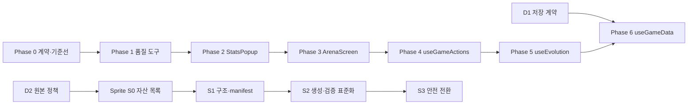

# P3 장기 리팩터링 실행 계획

**상태:** 실행 전 계획

**작성일:** 2026-07-13

**기준선 갱신일:** 2026-07-17

**대상:** `digimon-tamagotchi-frontend`

**목표:** 동작과 저장 계약을 유지하면서 대형 파일, 품질 도구, 스프라이트 자산 파이프라인을 작은 검증 단위로 정리한다.

## 1. 결론

이 작업은 한 번에 파일을 재작성하는 방식이 아니라 아래 순서로 진행한다.

1. 1단계·1.5단계·2단계에서 고정한 테스트와 CI 기준선을 출발점으로 사용한다.
2. 독립 실행 가능한 품질 명령을 먼저 만든다.
3. `StatsPopup.jsx`, `ArenaScreen.jsx`를 테스트 → 순수 계산 → 부작용 → UI 순으로 분리한다.
4. `useGameActions.js` → `useEvolution.js` → `useGameData.js` 순으로 분리한다.
5. 스프라이트 파이프라인은 별도 병렬 트랙으로 진행하되 `package.json` 변경은 런타임 트랙과 순차 적용한다.

`useGameData.js`는 저장, lazy update, revision/outbox에 모두 닿는 가장 위험한 파일이므로 마지막에 작업한다. 줄 수 감소는 결과 지표로만 사용하고, 책임 경계와 회귀 테스트 통과를 완료 기준으로 사용한다.

## 2. 확인된 현재 기준선

2026-07-17 기준이다. 대형 파일과 품질 도구 부채 수치는 2026-07-13 정적 분석 결과를 유지하고, 테스트·시간 계약·CI 상태는 병합된 최신 `main`으로 갱신했다.

| 항목 | 현재 상태 | 의미 |
|---|---:|---|
| `StatsPopup.jsx` | 2,158줄 | UI, 시간 계산, 개발자 변경, 저장 요청이 혼재 |
| `ArenaScreen.jsx` | 1,980줄 | UI 상태, Firestore 조회/쓰기, 등록, 리플레이가 혼재 |
| `useGameData.js` | 1,520줄 | 로드/저장, payload, lazy update, 복구 정책이 혼재 |
| `useGameActions.js` | 1,447줄 | 다수의 순수 builder와 액션 오케스트레이션이 혼재 |
| `useEvolution.js` | 1,021줄 | 일반 진화와 조그레스 저장/배치 쓰기가 혼재 |
| 프런트 테스트 | 159 suite, 941 test 전부 통과 | 1단계에서 기존 실패를 정비하고 녹색 기준선을 복구함 |
| 서버 테스트 | 156개 통과, Firestore Emulator 전용 1개 건너뜀 | 자격증명이 없는 결정적 단위 테스트 기준선 |
| 1.5단계 시간 계약 | `TZ=UTC`, `TZ=Asia/Seoul` 결과 동일 | 수면·스탯·동기화 표시를 고정 UTC+9(KST)로 통일함 |
| Node 24 CI | `ubuntu-24.04`, `CI / check` 성공 | PR과 `main` push가 같은 `npm run check`를 실행함 |
| 전체 ESLint | 166 errors, 1 warning | 오류 대부분은 테스트의 Testing Library 규칙 부채 |
| 운영 코드 ESLint | 0 errors, 1 warning | `SlotRepository.js`의 미사용 `where` |
| JSDoc | 52개 파일에 타입 태그 존재 | 전면 TypeScript보다 `checkJs` 확장이 현실적 |
| 테스트 로그 | 전체 실행에서 `console.log` 출력 블록 62개 | 전역 숨김이 아니라 발생 지점 정리가 필요 |
| 스프라이트 후보 | 25개 | 저장소 밖 `D2_LOCAL_ARCHIVE/sprite-inbox`에 SHA-256 목록과 함께 보존, 저장소 승격 여부는 별도 결정 |

현재 인증/저장 설명서는 Firestore를 슬롯 원본으로, localStorage를 보조 저장소로 설명한다. 반면 저장소 작업 가이드에는 이중 저장소 지원이 적혀 있어 `useGameData.js` 작업 전 계약 확정이 필요하다.

## 3. 변경하지 않을 것

P3의 기본값은 구조 리팩터링이며 다음 계약은 바꾸지 않는다.

- `users/{uid}/slots/{slotId}`를 포함한 Firestore 경로와 슬롯 문서 스키마
- lazy update 계산과 “실시간 타이머는 Firestore에 쓰지 않는다”는 규칙
- modal key, route, 외부에서 사용하는 component props와 hook 반환 shape
- 진화 조건, 배틀 계산, 게임 밸런스와 사용자에게 보이는 한국어 문구
- 스프라이트의 `spriteBasePath + 번호.png` 런타임 조회 계약
- 일반 진화와 조그레스의 revision, outbox, 원자적 batch 저장 의미

계약 변경이 필요해지면 현재 단계에서 멈추고 별도 설계 승인 후 진행한다.

## 4. 실행 전 결정 게이트

### D1. 공식 슬롯 저장 계약

**권장안:** 현재 런타임과 `docs/CURRENT_AUTH_STORAGE_CONTRACT.md`에 맞춰 Firestore를 슬롯의 단일 원본으로, localStorage를 UI 설정·보조값 저장소로 공식화한다.

- 이 안을 선택하면 오래된 localStorage 슬롯 분기는 호출처를 확인한 뒤 별도 호환성 정리 단계에서 제거한다.
- 완전 오프라인 이중 저장소를 다시 지원하려면 repository 계약 테스트, 충돌 정책, 마이그레이션을 포함한 별도 프로젝트로 분리한다.
- 결정 전에는 기존 localStorage 분기나 `repositories` 구현을 삭제하거나 새 저장 경계로 채택하지 않는다.

**차단 범위:** Phase 2~5의 순수 계산/UI 추출은 진행할 수 있지만, Phase 6 `useGameData.js` 저장 경계 확정은 D1 결정 전 시작하지 않는다.

### D2. 스프라이트 원본 보관 정책

**권장안:** 재배포 권한이 확인된 원본만 저장소의 `assets/sprites/raw/`에 추적하고, 권한이나 출처가 불명확한 원본은 저장소 밖 `SPRITE_SOURCE_ROOT`에 보관한다. 두 경우 모두 manifest에 상대 경로, SHA-256, 출처와 권한을 기록한다.

- 현재 후보 이미지 25개는 저장소 밖 `D2_LOCAL_ARCHIVE/sprite-inbox`에 파일명·크기·해상도·SHA-256 목록과 함께 보존한다. 이후 사용자가 `raw 승격`을 결정한 자산만 별도 변경으로 저장소에 반영한다.
- `inbox`는 후보 투입 장소일 뿐 빌드 입력으로 사용하지 않는다.
- 분류 전 `.gitignore` 추가, 이동, 이름 변경, 삭제를 하지 않는다.

### D3. 타입 검사 전략

P3에서는 단계적 JSDoc `checkJs`를 사용한다. 전면 TypeScript 전환은 별도 프로젝트로 둔다.

## 5. 의존 순서



스프라이트 트랙은 Phase 1 이후 병렬로 진행할 수 있다. 다만 두 트랙이 동시에 `package.json`, lockfile, `.gitignore`를 수정하지 않도록 체크포인트를 순차 적용한다.

## 6. 단계별 실행 계획

### Phase 0. 계약과 녹색 기준선 고정

**목적:** 구조 변경의 회귀인지 기존 문제인지 구분할 수 있는 출발점을 만든다.

#### 작업

1. D1의 공식 저장 계약을 확정하고, D2의 저장소 승격 기준을 문서에 반영한다.
2. 완료된 1단계 테스트 복구, 1.5단계 KST 계약, Node 24 CI 기준선을 P3의 선행 조건으로 고정한다.
3. 프런트 941개, 서버 156개, build와 server projection 검사 결과를 기준선으로 기록한다.
4. `StatsPopup`, `ArenaScreen`, 일반 진화, 조그레스, 슬롯 저장/로드의 현재 동작을 characterization test로 보강할 목록을 확정한다.

#### 종료 조건

- 프런트 159개 test suite·941개 test와 서버 156개 test가 통과하고, Firestore Emulator 전용 1개만 명시적으로 건너뛴다.
- `TZ=UTC`와 `TZ=Asia/Seoul`에서 시간 의존 테스트 결과가 같다.
- Node 24·Ubuntu 24.04의 `CI / check`가 PR과 `main` push에서 성공한다.
- `NODE_OPTIONS=--openssl-legacy-provider npm run build`가 통과한다.
- D1의 선택 결과가 `AGENTS.md`와 `docs/CURRENT_AUTH_STORAGE_CONTRACT.md`에서 모순되지 않는다.
- 런타임 코드 변경과 계약 문서 변경은 별도 체크포인트로 남긴다.

### Phase 1. 품질 도구를 독립 명령으로 도입

**목적:** CRA build나 test 실행에 기대지 않고 각 품질 축을 따로 검증한다.

#### 1A. ESLint

- `eslint`와 필요한 plugin을 직접 `devDependencies`로 고정한다.
- 운영 코드용 `npm run lint`와 테스트 코드 부채 확인용 `npm run lint:tests`를 분리한다.
- 먼저 운영 코드의 1개 warning을 제거하고 `lint`를 차단 게이트로 만든다.
- 테스트의 기존 166개 오류는 규칙별 목록을 기록하고 작은 묶음으로 정리한다. 리팩터링 중 건드린 테스트에서는 오류 수가 증가하지 않아야 한다.
- P3 종료 시 `lint:tests`도 0 errors가 되거나, 팀이 의도적으로 끈 규칙만 설정 파일에 근거와 함께 남긴다.

#### 1B. JSDoc 타입 검사

- 직접 버전의 `typescript`와 `tsconfig.checkjs.json`을 추가한다.
- 첫 범위는 `src/logic/**`와 공유 pure utility로 제한한다.
- `npm run typecheck`를 추가하고, 이후 추출되는 pure helper를 매 단계 include 범위에 추가한다.
- hook/component 전체 `checkJs`는 오류를 숨기는 대규모 suppress 없이 별도 후속 단계에서 확대한다.

#### 1C. dead-code 검사

- `knip`을 직접 의존성으로 추가하고 `npm run deadcode`를 만든다.
- CRA entrypoint, test, script, Firebase 동적 참조를 명시적으로 설정한다.
- 첫 실행은 report-only다. `src/data/nonuse/` 등 후보는 사용 여부와 보관 이유를 분류한 뒤 별도 커밋에서만 삭제한다.

#### 1D. console 정책

- 테스트 중 반복되는 raw `console.log`는 발생 지점에서 제거한다.
- 필요한 운영 오류는 `console.warn/error` 또는 공용 logger로 유지하고, 해당 테스트에서 `jest.spyOn`으로 검증한다.
- Jest 전역 mock이나 `--silent`로 모든 출력을 숨기지 않는다.
- 목표 파일을 수정할 때 새 raw `console.log`를 추가하지 않는다.

#### 종료 조건

- `npm run lint`, `npm run typecheck`, 전체 test, build가 각각 독립적으로 성공한다.
- `npm run lint:tests`, `npm run deadcode`의 기존 부채가 수치와 파일 목록으로 기록된다.
- 변경된 파일에서 불필요한 `console.log`가 0개다.

### Phase 2. `StatsPopup.jsx` 분리

**위험도:** 높음

**원칙:** 문구·스타일·props를 바꾸지 않는 기계적 추출부터 시작한다.

#### 2A. 동작 고정 테스트

- 기존/신규 탭 렌더링
- 수면 상태와 기상/소등 동작
- 냉장고 경과 시간 표시
- 케어미스·부상 이력
- 개발자 모드 스탯 변경과 poop/injury 연쇄 결과
- 로그 append와 `onChangeStats` 호출 순서

#### 2B. 순수 계산 추출

`src/components/stats-popup/` 아래에 다음 책임을 둔다.

- `statsPopupViewModel.js`: 표시값, 범위, 시간 문자열, 상태 label 계산
- `statsPopupMutations.js`: 개발자 스탯 변경 결과와 저장 payload 조립
- 기존 `src/utils/fridgeTime.js`, `src/utils/sleepUtils.js` 재사용

모든 helper는 입력과 반환값만 가지며 React state, DOM, Firebase를 참조하지 않는다.

#### 2C. UI presenter 추출

- `StatsOverviewSection.jsx`
- `SleepSection.jsx`
- `CareHistorySection.jsx`
- `DeveloperStatsSection.jsx`

presenter는 props를 렌더링하고 사용자 intent만 callback으로 전달한다.

#### 2D. controller와 저장 경계 분리

- `useStatsPopupController.js`가 popup 로컬 상태와 사용자 이벤트를 오케스트레이션한다.
- payload 조립은 `statsPopupMutations.js`에서 수행한다.
- 로그 append와 stats commit은 기존 callback 계약을 감싼 persistence adapter에서만 실행한다.
- Firestore 경로, 저장 횟수와 호출 순서는 바꾸지 않는다.

#### 종료 조건

- `StatsPopup.jsx`는 modal shell과 section 조립만 담당한다.
- `StatsPopup.jsx`와 presenter에 payload 조립 또는 Firestore 호출이 없다.
- 추출한 pure helper에 단위 테스트가 있다.
- 기존 스냅샷/DOM, callback 횟수·인자, 전체 test와 build가 동일하게 통과한다.

### Phase 3. `ArenaScreen.jsx` 분리

**위험도:** 매우 높음

**원칙:** 하나의 거대한 `useArenaScreen`으로 옮기지 않고 조회·등록·로그·리더보드를 분리한다.

#### 3A. 동작 고정 테스트

- 참가 등록/삭제와 등록 제한
- 도전자 목록과 슬롯 선택
- 배틀 로그, 리플레이 복원
- 리더보드와 archive fallback
- Firebase 사용자 유무에 따른 현재 동작
- Firestore query 실패/빈 결과 상태

#### 3B. 순수 로직 추출

`src/logic/arena/`에 normalize, leaderboard 정렬, replay 변환, 등록 snapshot/payload builder를 둔다. 기존 `useArenaLogic.js`의 순수 계산은 재사용하거나 이 디렉터리로 이동하고 호환 re-export를 유지한다.

#### 3C. Firestore adapter 추출

`src/repositories/ArenaRepository.js`를 현재 Arena 전용 저장 경계로 추가한다.

- entries/challengers/logs/leaderboard 조회
- 참가 등록/삭제
- archive fallback
- timestamp와 query 조건 조립

컴포넌트와 domain hook은 Firebase SDK를 직접 import하지 않는다. 현재 collection path, query, index fallback과 오류 의미는 contract test로 고정한다.

#### 3D. domain hook 분리

- `useArenaEntries.js`
- `useArenaBattleLogs.js`
- `useArenaLeaderboard.js`
- `useArenaRegistration.js`
- `useArenaReplay.js`

각 hook은 하나의 비동기 lifecycle만 소유한다. 공용 UI 상태를 모은 대형 hook은 만들지 않는다.

#### 3E. presenter 분리

- 참가/슬롯 section
- 도전자 section
- 배틀 로그/리플레이 section
- 리더보드 section

`ArenaScreen.jsx`는 domain hook의 결과를 presenter에 연결한다.

#### 종료 조건

- `ArenaScreen.jsx`에 Firebase SDK import와 Firestore 호출이 0개다.
- 순수 helper는 Firestore/React 없이 단위 테스트된다.
- repository query와 저장 호출은 contract test로 검증된다.
- alert/confirm 문구, loading/empty/error UI와 현재 저장 경로가 유지된다.

### Phase 4. `useGameActions.js` 분리

**위험도:** 중간~높음

**선행 이유:** 파일 앞부분에 이미 순수 builder가 많이 있어 가장 낮은 위험으로 hook 경계를 줄일 수 있다.

#### 작업

1. 기존 exported builder를 `src/logic/actions/`로 이동한다.
2. payload, outcome, activity log 문자열 builder를 각각 pure module로 분리한다.
3. 기존 import가 깨지지 않도록 `useGameActions.js`에서 한 단계 동안 compatibility re-export를 유지한다.
4. 저장은 기존 `useDurableGamePersistence.js`와 injected save 함수를 재사용한다. 병렬 persistence 체계를 새로 만들지 않는다.
5. hook에는 상태 확인, 액션 순서, 애니메이션 호출과 commit 요청만 남긴다.

#### 종료 조건

- hook 본문에서 대형 payload와 로그 문자열을 직접 조립하지 않는다.
- 새 pure module의 입력/출력과 경계값 단위 테스트가 통과한다.
- 사용자 액션별 저장 횟수, lazy update 선행 순서, 활동 로그 순서가 기존 테스트와 같다.

### Phase 5. `useEvolution.js` 분리

**위험도:** 높음

**핵심 위험:** 일반 진화와 조그레스의 저장 의미가 다르며, 조그레스는 두 슬롯 batch, revision, outbox를 보존해야 한다.

#### 작업

1. 진화 후보 계산과 진화 결과 state/payload를 `src/logic/evolution/`의 pure module로 이동한다.
2. 일반 진화는 현재 injected save 경계를 유지한다.
3. 조그레스 전용 `JogressPersistence` port와 Firestore adapter를 추가한다.
4. hook에서 `writeBatch`, `updateDoc`, `serverTimestamp` 직접 사용을 제거한다.
5. 현재 슬롯과 파트너 슬롯의 lazy update 적용 시점, expected revision과 outbox 복구를 테스트로 고정한다.

#### 종료 조건

- `useEvolution.js`에 Firebase SDK import가 0개다.
- 두 슬롯 쓰기가 하나의 batch로 유지된다.
- 성공/부분 실패/충돌/재시도 테스트에서 revision과 outbox 결과가 기존 계약과 같다.
- 일반 진화가 중복 저장되지 않는다.

### Phase 6. `useGameData.js` 분리

**위험도:** 매우 높음

**시작 조건:** D1 확정, Phase 0~5 녹색.

#### 작업

1. 저장/로드/lazy update/revision/outbox/error fallback characterization test를 먼저 추가한다.
2. `src/hooks/game-persistence/`에 아래 pure module을 둔다.
   - `gameSavePayload.js`
   - `gameSlotHydration.js`
   - `gamePersistencePolicy.js`
3. Firestore SDK 호출은 저장 adapter로 이동한다.
4. 기존 `useDurableGamePersistence.js`와 역할을 합의해 중복 retry/outbox 구현을 만들지 않는다.
5. `useGameData.js`에는 repository 선택, load/save lifecycle, React state 연결만 남긴다.
6. D1이 Firestore 단일 원본이면 잘못된 `local` mode 표시는 모든 호출처를 확인한 별도 호환성 커밋에서 정리한다.
7. D1이 이중 저장소 복원이라면 Phase 6을 중단하고 repository contract, 충돌 정책, 로컬→클라우드 마이그레이션을 별도 계획으로 확장한다.

#### 종료 조건

- `useGameData.js`에 Firestore payload 필드 조립과 Firebase SDK 직접 호출이 없다.
- lazy update 후 저장 순서와 쓰기 횟수가 동일하다.
- auth 없음, 문서 없음, revision 충돌, 네트워크 실패, outbox 복구가 각각 테스트된다.
- 공식 저장 모드와 hook이 반환하는 mode가 일치한다.

## 7. 병렬 트랙 S — 스프라이트 자산 파이프라인

### S0. 목록과 분류

- 현재 `Ver3_Mod_TH`, `Ver4_Mod_codex_48`, `Ver5_Mod_codex_48`의 추적/미추적 파일을 inventory로 출력한다.
- 각 파일을 `raw 승인`, `inbox 후보`, `중간 결과`, `배포 결과` 중 하나로 분류한다.
- 현재 미추적 25개는 사용자 확인 전 변경하지 않는다.

### S1. 디렉터리와 manifest

목표 구조는 다음과 같다.

```text
digimon-tamagotchi-frontend/
├── assets/sprites/
│   ├── inbox/                 # 빌드 입력 금지, 기본 미추적
│   ├── raw/{v3,v4,v5}/       # 승인된 원본만 추적
│   └── manifests/             # 출처·checksum·프레임 계약
├── artifacts/sprites/         # 재생성 가능한 중간 결과, ignore
└── public/VerN_Mod_codex/     # 실제 배포 결과
```

manifest의 필수 필드는 `assetId`, `version`, `baseSprite`, `frameCount`, `sourceFile`, `sha256`, `width`, `height`, `provenance`, `license`, `redistributable`이다.

원본을 저장소에 둘 수 없다면 `sourceFile`은 `SPRITE_SOURCE_ROOT` 기준 상대 경로로 기록하고 checksum 검증을 통과한 파일만 입력으로 사용한다.

### S2. 생성·검증 명령 표준화

`package.json`에 다음 독립 명령을 둔다.

- `sprites:inventory`
- `sprites:v3:generate`, `sprites:v4:generate`, `sprites:v5:generate`
- `sprites:v3:build`, `sprites:v4:build`, `sprites:v5:build`
- `sprites:verify`
- `test:sprites`

스크립트의 개인 절대 경로를 제거하고 CLI 인자 또는 `SPRITE_SOURCE_ROOT`만 사용한다. 모든 실행 파일은 `require.main === module` guard를 사용해 import 시 실행되지 않게 한다.

### S3. 안전한 생성과 전환

1. 임시 디렉터리에 생성한다.
2. 파일 수, 48×48 규격, alpha, 번호 연속성, manifest checksum을 read-only로 검증한다.
3. 검증 성공 후에만 최종 디렉터리를 교체한다.
4. V3/V4/V5에 대칭적인 검증 테스트를 둔다.
5. 기존 중간 결과는 새 파이프라인으로 동일 결과를 재생성한 뒤 별도 승인 커밋에서만 제거한다.

#### 종료 조건

- 새 환경에서 개인 경로 없이 동일한 배포 자산을 재생성할 수 있다.
- 검증 실패 시 기존 `public/VerN_Mod_codex/`가 변경되지 않는다.
- 미추적 원본 후보가 모두 정책에 따라 분류되어 `git status`에 우발적으로 남지 않는다.

## 8. 공통 테스트 게이트

모든 명령은 `digimon-tamagotchi-frontend`에서 실행한다.

| 게이트 | 실행 시점 | 실패 시 처리 |
|---|---|---|
| 변경 pure helper 단위 테스트 | 매 추출 체크포인트 | wiring 진행 중단 |
| 대상 component/hook 테스트 | 매 wiring 체크포인트 | 해당 단계 revert 또는 수정 |
| `npm run lint` | 매 체크포인트 | 커밋 금지 |
| `npm run typecheck` | 매 체크포인트 | 새 suppress 없이 수정 |
| 전체 test | 각 phase 종료 | 다음 phase 진행 금지 |
| production build | 각 phase 종료 | 다음 phase 진행 금지 |
| `npm run deadcode` | 각 phase 종료 | 신규 미사용 export를 제거하고 기존 부채와 구분 |
| `npm run sprites:verify` | 스프라이트 변경 시 | public 결과 교체 금지 |

Firebase와 localStorage 관련 테스트는 D1에서 확정한 공식 모드와 보조 동작을 구분해 작성한다. 시간 기반 테스트는 fake timer와 고정 timestamp를 사용하며 실제 1초 저장 타이머를 만들지 않는다.

## 9. 체크포인트 운영

각 phase는 가능하면 다음 순서로 나눈다.

1. **characterization test:** 현재 동작만 고정
2. **pure extraction:** import 이동과 compatibility re-export
3. **side-effect boundary:** repository/persistence adapter 연결
4. **presenter/orchestrator wiring:** UI와 hook을 얇게 조립
5. **문서:** `docs/REFACTORING_LOG.md`에 날짜, 영향 파일, 결정 근거 기록

한 체크포인트에 구조 이동과 UI 변경, 데이터 계약 변경을 같이 넣지 않는다. sprite 변경도 런타임 hook 리팩터링과 같은 커밋에 섞지 않는다.

## 10. 위험과 대응

| 위험 | 대응 |
|---|---|
| 저장 계약을 잘못 전제 | D1 전에는 저장 구현을 삭제·교체하지 않음 |
| lazy update 또는 쓰기 횟수 회귀 | 시간 고정 테스트와 persistence 호출 횟수 검증 |
| Arena query/index 회귀 | repository contract test로 path/query/fallback 고정 |
| 조그레스 부분 저장 | batch atomicity, revision, outbox 테스트 선행 |
| 순환 import/호환 import 파손 | 한 단계 compatibility re-export 후 호출처 일괄 전환 |
| test lint 부채가 본 작업을 차단 | 운영 lint는 즉시 gate, 테스트 부채는 수치화해 단계적으로 0으로 감소 |
| 원본 이미지 유실/오추적 | D2 분류 전 이동·삭제·ignore 금지, checksum manifest 사용 |
| 생성 실패로 public 자산 손상 | temp 생성 → read-only 검증 → 성공 시 교체 |

## 11. 롤백 전략

- 각 extraction은 props와 export를 유지하므로 해당 체크포인트만 revert할 수 있어야 한다.
- repository adapter 도입 전후 저장 payload를 contract test fixture로 비교한다.
- Firestore 경로/스키마 migration은 P3에 포함하지 않으므로 데이터 롤백 작업이 생기지 않아야 한다.
- 스프라이트는 기존 public 결과를 수정하기 전에 새 결과를 임시 경로에서 검증한다. 실패하면 임시 결과만 폐기한다.
- 호환 re-export는 모든 호출처와 test가 새 경로로 전환된 다음 별도 체크포인트에서 제거한다.

## 12. 완료 정의

P3는 다음 조건을 모두 만족할 때 완료한다.

1. `StatsPopup.jsx`, `ArenaScreen.jsx`는 UI 조립만 하고 Firestore/payload/pure 계산을 직접 소유하지 않는다.
2. `useGameActions.js`, `useEvolution.js`, `useGameData.js`는 orchestration만 하고 순수 계산과 Firestore SDK 호출은 각각 logic/persistence 경계에 있다.
3. Firestore path, slot schema, lazy update, revision/outbox, modal/route 계약이 바뀌지 않았다.
4. 독립 `lint`, `typecheck`, `deadcode`, test, build 명령이 문서화되어 실행 가능하다.
5. 신규·변경 코드에 raw debug `console.log`가 없다.
6. 새 pure module과 persistence adapter에 단위/contract test가 있다.
7. 스프라이트의 원본·중간·배포 결과가 구조와 manifest로 구분되고, 생성·검증 명령이 개인 절대 경로 없이 동작한다.
8. 전체 test와 production build가 녹색이다.
9. 각 주요 변경이 `docs/REFACTORING_LOG.md`에 기록되어 있다.

## 13. 범위 밖

- 전체 TypeScript 전환
- Create React App에서 Vite 등으로의 빌드 시스템 마이그레이션
- Firestore schema/path 변경
- 완전 오프라인 저장 모드 신규 구현 또는 복원
- 화면 디자인, 한국어 문구, 게임 밸런스 변경
- 미확인 원본 이미지의 임의 삭제 또는 저장소 추적

## 14. 첫 실행 묶음

가장 먼저 진행할 실제 작업은 다음 네 체크포인트로 제한한다.

1. D1/D2 결정 문서화
2. 현재 941/941 프런트·156개 서버 테스트와 KST/CI 기준선을 characterization 목록에 연결
3. 독립 운영 코드 ESLint 명령 + logic 범위 `checkJs` 도입
4. `StatsPopup` characterization test 보강

1단계 테스트 복구, 1.5단계 KST 계약, Node 24 CI 구축은 완료된 선행 기준선이다. 위 네 단계 중 남은 D1/D2 문서 결정과 품질 도구·characterization test가 녹색이 된 뒤에만 `StatsPopup.jsx` 본체 분리를 시작한다. `lint`, 타입 검사, dead-code 검사는 아직 P3 후속 작업이며 현재 CI 완료로 간주하지 않는다.
