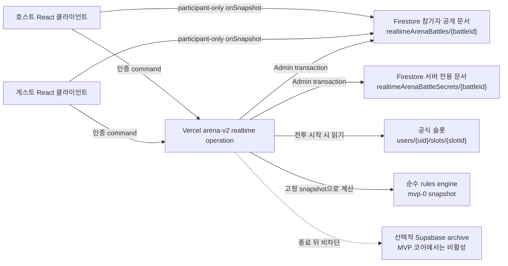
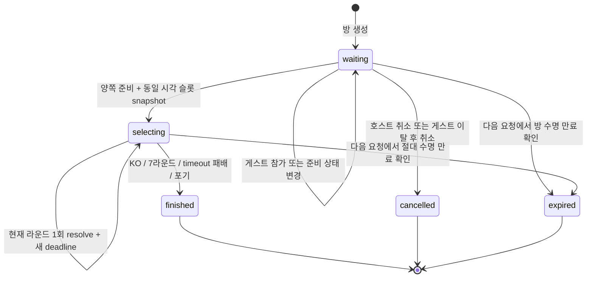

# 실시간 아레나 MVP 개발 실행 계획

- 문서 상태: **READY FOR IMPLEMENTATION**
- 작성일: 2026-07-30
- 대상: Firebase 로그인 사용자 간 1대1 동시 선택형 실시간 아레나
- 기준 브랜치: `main`
- 기준 HEAD: `6696552489f7b224f8bb587d8a213d346e3dc0d0`
- 규칙 기준선: 임시 `mvp-0 = R2 + S1 + H2 + P25 + M1`
- 구현 원칙: 서버·동시성·복구 기반을 먼저 만들고 전투 규칙은 버전으로 교체한다.

관련 기준 문서:

- [실시간 아레나 밸런스 분석 요청서](./REALTIME_ARENA_BALANCE_ANALYSIS_REQUEST.md)
- [실시간 아레나 밸런스 분석 보고서](./REALTIME_ARENA_BALANCE_ANALYSIS_REPORT.md)
- [기존 Ghost 아레나 구현 계획](./ARENA_GHOST_SYSTEM_IMPLEMENTATION_PLAN.md)
- [API 배포 구조](./API_DEPLOYMENT_STRUCTURE.md)

이 문서는 위 분석을 실제 개발 순서로 바꾼 실행 계획이다. 서버 아키텍처와 상태 계약을 다시 비교하지 않는다. 또한 이 문서 자체는 프로덕션 코드, Rules, 인덱스, 설정, 데이터 또는 lockfile을 변경하지 않는다.

---

## 0. 구현 후속 변경: `mvp-2` 선택·연출 계약 (2026-08-02)

초기 `mvp-0/1` 계약과 진행 중 snapshot은 그대로 보존한다. 2026-08-02 이후 생성되는 새 배틀은 `mvp-2`를 사용하며 아래 항목이 이 문서의 기존 즉시 판정·`no_action` 설명보다 우선한다.

- 라운드는 양쪽이 일찍 선택해도 7초 마감까지 열린다. 각 참가자는 행동을 변경할 수 있고 서버는 가장 높은 `selectionRevision`의 마지막 선택을 사용한다.
- 미선택 참가자는 secret의 `battleSeed`와 `battleId + round + role`로 공격·방어·특수공격 중 하나를 균등하고 결정적으로 자동 선택한다. `mvp-2`에는 연속 timeout 패배가 없다.
- 상대의 현재 선택은 secret에만 두며 마감 전 공개하지 않는다. 판정 public 기록에는 양쪽 행동, 피해량과 `manual/auto/cpu` 출처를 함께 저장한다.
- 판정 뒤 `presentationEndsAt = 판정 시각 + 2.2초`, 다음 `deadlineAt = presentationEndsAt + 7초`로 설정한다. 클라이언트는 서버 시각을 기준으로 동시 행동 공개, 공격 스프라이트, 중앙 방패, 피해 숫자와 HP 변화를 재생한다.
- `viewer`는 호출자 자신의 `selectedAction`과 `selectionRevision`만 반환한다. 새로고침 후 선택 강조는 복구하지만 상대 행동이나 secret 원문은 반환하지 않는다.
- `selectionOpensAt`과 `presentationEndsAt` 표시는 로컬 타이머로 계산하며 Firestore에 초 단위 쓰기를 추가하지 않는다. 최종 KO·최대 라운드도 연출이 끝난 뒤 결과 화면으로 전환한다.
- 실시간 아레나 client schema 최소 버전은 2다. 이전 클라이언트에는 새로고침 안내를 반환한다.

---

## 1. 최종 결론

실시간 아레나는 지금 구현을 시작해도 된다. 현재 막혀 있는 것은 서버 구조가 아니라 행동 판정표의 최종 밸런스다.

따라서 개발은 다음 두 층을 분리한다.

1. 규칙과 무관하게 유지되는 기반
   - 인증
   - 방 생성·참가·준비
   - 서버 슬롯 스냅샷
   - 공개/secret 상태 분리
   - 행동 제출
   - `battleId + round` 멱등 판정
   - deadline·timeout
   - 재접속 복구
   - Firestore Rules와 동시성 테스트
   - 최소 플레이 UI
2. 교체 가능한 규칙
   - 행동 판정표
   - 피해 공식
   - HP·기본 공격력
   - `powerGapUnit`
   - 매칭 단계 범위

첫 구현은 `mvp-0` 규칙으로 통합·플레이테스트한다. 이 값은 출시 확정값이 아니며, 후속 변경은 기존 값을 수정하지 않고 `mvp-1`을 추가한다.

공개 랭크, 영구 경쟁 전적, 보상, 자동 매칭 큐는 이번 MVP에 넣지 않는다. 밸런스 보고서에서 공격의 약한 지배와 HP 우세 측 방어 굳히기가 확인됐기 때문이다.

### 1.1 MVP 로비 가정

아직 별도 제품 계약으로 확정되지 않은 진입 UX는 다음처럼 가장 작은 범위로 고정한다.

- 호스트가 방을 만들고 불투명한 `battleId`를 공유한다.
- 게스트가 해당 ID를 입력해 참가한다.
- 양쪽이 준비하면 서버가 같은 기준 시각으로 슬롯을 투영하고 전투를 시작한다.
- 무작위 자동 매칭과 대기열 검색은 후속 범위다.

이 가정은 현재 남아 있는 미사용 `realtime_battle_rooms` 인덱스를 재사용하지 않으며, MVP에 새 복합 인덱스와 공개 방 목록을 만들지 않는다.

---

## 2. 변경하지 않는 계약

다음 항목은 구현 중 편의에 따라 바꾸지 않는다.

- Firebase Auth가 참가자 신원을 확정한다.
- 기존 Vercel `arena-v2` 서버리스 진입점을 재사용한다.
- Firestore가 진행 중 상태와 최종 결과의 유일한 정본이다.
- 참가자 공개 상태는 `realtimeArenaBattles/{battleId}`에 둔다.
- 미공개 행동과 호출자별 상태는 `realtimeArenaBattleSecrets/{battleId}`에 둔다.
- 첫 행동 제출은 secret 문서만 갱신한다.
- 첫 행동 제출로 공개 문서의 `updateTime`, `updatedAt`, `stateVersion`, `status`, `round`, `deadlineAt`가 바뀌면 안 된다.
- 자신의 제출 여부는 인증 API의 `viewer.hasSubmitted`로만 복구한다.
- 라운드 판정의 고유 단위는 `battleId + round`다.
- 양쪽 제출이 모이면 두 번째 제출 transaction 안에서 판정한다.
- deadline은 서버 시각으로 검증한다.
- 한 요청은 만료된 현재 라운드 하나만 처리한다.
- 새 라운드 deadline은 판정 시점부터 7초로 다시 시작한다.
- 같은 참가자의 연속 2회 timeout은 패배다.
- 양쪽이 같은 라운드에서 동시에 연속 2회 timeout에 도달하면 무승부로 종료한다.
- 배틀 중 현재 HP와 라운드 상태를 원본 슬롯에 기록하지 않는다.
- MVP는 종료 시에도 슬롯 전적·에너지·체중·보상을 변경하지 않는다.
- 상시 라운드 스케줄러와 초 단위 Firestore write를 추가하지 않는다.
- Ably는 MVP 판정·상태·알림 경로에서 사용하지 않는다.
- Supabase archive는 코어 출시 조건이 아니며, 실패가 배틀 종료를 막지 않는다.
- viewer 응답은 `Cache-Control: private, no-store`를 사용한다.
- 행동, secret 원문, 양쪽 제출 상태, viewer 민감 필드를 로그나 분석 이벤트에 남기지 않는다.

---

## 3. 현재 코드 기준선과 구현 간극

현재 저장소에는 실시간 아레나 런타임이 없다. 재사용 가능한 기반과 새로 만들어야 하는 부분은 다음과 같다.

| 영역 | 현재 코드 | 개발 방향 |
|---|---|---|
| Vercel 진입점 | `api/arena-v2.js`의 operation map | 진입점 추가 없이 realtime operation만 등록 |
| 공개 URL | `vercel.json` rewrite | realtime collection/command rewrite 2개 추가 |
| 인증 | `api/_lib/auth.js`의 `verifyRequestUser()` | 그대로 재사용 |
| Admin Firestore | `api/_lib/arenaTransactions.js` | 그대로 재사용 |
| 슬롯 projection | `api/_lib/arenaGhostHandlers.js`의 `projectArenaSlot()` | 공용 모듈로 안전하게 추출 후 Ghost와 realtime이 공유 |
| power 계산 | `src/logic/battle/hitrate.js`와 서버 projection bundle | `calculatePower()`만 재사용 |
| 기존 Ghost 판정 | `src/logic/arena/calculator.js` | 재사용 금지. 실시간 규칙은 별도 도메인으로 신설 |
| 기존 속성 함수 | `getAttributeAdvantage()`의 `+5/-5` | 재사용 금지. realtime용 `+1/0` 함수를 신설 |
| 서버 공유 bundle | `src/server/gameProjectionEntry.js` | realtime 순수 규칙 export 추가 후 생성물 갱신 |
| 공개 상태 구독 | 현재 없음 | Firestore 단일 문서 `onSnapshot()` 사용 |
| viewer 복구 | 현재 없음 | 인증된 POST command 응답으로만 제공 |
| UI 진입점 | `CommunicationModal`의 비활성 `실시간 배틀` 버튼 | feature flag 아래에서 새 화면을 연다 |
| 실시간 화면 | 현재 없음 | 기존 1,984줄 `ArenaScreen`과 분리해 신설 |
| Rules | realtime 컬렉션 규칙 없음 | public 참가자 get만 허용, 모든 client write와 secret 접근 차단 |
| Index | 미사용 `realtime_battle_rooms` 인덱스 한 개 | 새 계약에 재사용하지 않음. direct-ID MVP는 새 복합 인덱스 불필요 |

### 3.1 Vercel 함수 수

현재 실제 배포 진입점은 11개이고 저장소 검사는 Hobby 상한 12개를 강제한다. 새 파일을 `api/` 진입점으로 만들지 않고 기존 `arena-v2.js`에 operation을 추가해야 한다.

### 3.2 기존 Ghost 코드와의 경계

재사용한다.

- Firebase 인증
- 요청 필드 allowlist 패턴
- ArenaError 응답 envelope
- deterministic ID/hash helper
- Admin SDK transaction
- 슬롯 lazy projection
- `calculatePower()`
- 서버 projection bundle과 parity 검사

분리한다.

- Ghost의 명중률·seed 기반 단발 전투 계산
- Ghost의 `+5/-5` 속성 상성
- Ghost의 슬롯 비용·전적·시즌·archive fan-out
- legacy `ArenaScreen`과 `BattleScreen`의 완료 replay UI

---

## 4. MVP 범위와 비범위

### 4.1 구현 범위

- 로그인 사용자만 방 생성·참가
- 호스트·게스트 각각 현재 슬롯 하나 선택
- `mvp-0`은 `Child` 이상 같은 단계 시작을 보존하고, `mvp-1`부터 `Child` 이상이면 서로 다른 단계끼리도 시작 허용
- 준비 상태와 전투 시작
- 같은 기준 시각의 서버 슬롯 projection
- `mvp-0` 규칙 snapshot 고정
- 최대 7라운드, 라운드당 7초
- 공격·방어·특수공격 동시 선택
- 첫 제출 비공개
- 두 번째 제출 즉시 판정
- timeout `no_action`
- 연속 2회 timeout 패배
- 현재 라운드만 복구
- 새로고침·재접속 시 `viewer.hasSubmitted` 복원
- 포기·취소·장기 만료
- 최종 결과 화면
- Rules, 단위 테스트, Emulator 동시성 테스트
- Preview/비공개 2계정 플레이테스트

### 4.2 이번 MVP 비범위

- 자동 매칭 큐와 공개 방 검색
- Ably publish, channel, presence
- Supabase 동기 상태 저장
- 초 단위 Firestore timer write
- 상시 timeout scheduler
- Firestore TTL
- 공개 랭크·시즌·보상
- 기존 Ghost 전적과 합산
- 슬롯의 에너지·체중·육성 전적 갱신
- 관전자
- 채팅
- 행동 cooldown·충전·횟수 제한
- 중간 규칙 hot reload
- 진행 중 `mvp-0` 배틀을 `mvp-1`로 변환

---

## 5. 규칙 엔진 계약

### 5.1 `mvp-0` 임시 규칙

```js
const REALTIME_ARENA_RULESETS = {
  "mvp-0": {
    schemaVersion: 1,
    maxRounds: 7,
    selectionWindowMs: 7000,
    eligibleStages: [
      "Child",
      "Adult",
      "Perfect",
      "Ultimate",
      "Super Ultimate",
    ],
    matchingScope: "same_stage_only", // mvp-0
    // mvp-1: "eligible_stages"
    hpByStage: {
      Child: 10,
      Adult: 13,
      Perfect: 16,
      Ultimate: 19,
      "Super Ultimate": 20,
    },
    baseAttackByStage: {
      Child: 2,
      Adult: 3,
      Perfect: 4,
      Ultimate: 5,
      "Super Ultimate": 5,
    },
    powerGap: {
      formulaId: "floor_sqrt_positive_gap_over_unit",
      unit: 25,
    },
    attribute: {
      formulaId: "one_way_cycle_bonus",
      advantageBonus: 1,
      disadvantagePenalty: 0,
      freeIsNeutral: true,
    },
    specialAttack: {
      bonus: 1,
      reducedVsAttackFormulaId: "ceil_ratio",
      reducedVsAttackNumerator: 1,
      reducedVsAttackDenominator: 4,
      guardPenetrationFormulaId: "ceil_ratio",
      guardPenetrationNumerator: 1,
      guardPenetrationDenominator: 2,
    },
    timeout: {
      missingAction: "no_action",
      consecutiveLossCount: 2,
    },
  },
};
```

실제 저장 snapshot에는 함수, class instance, 정규식 또는 실행 가능한 문자열을 넣지 않는다. 숫자, 문자열, boolean, 배열, plain object만 저장한다.

### 5.2 버전 불변식

- `mvp-0` 객체를 배포 뒤 수정하지 않는다.
- `mvp-1`은 새 키로 추가한다.
- 활성 규칙은 서버가 결정하고 클라이언트 입력을 받지 않는다.
- 방 생성 시에는 선택된 슬롯만 기록한다.
- 양쪽 준비가 완료되어 전투가 시작될 때 `rulesVersion`, `rulesSnapshot`, `rulesSnapshotHash`를 고정한다.
- 진행 중 transaction은 항상 battle에 저장된 snapshot으로 계산한다.
- registry의 현재 기본값이 바뀌어도 진행 중·종료된 `mvp-0` 결과는 재현돼야 한다.
- snapshot hash는 기존 canonical JSON hash helper를 재사용한다.
- public snapshot과 secret hash가 다르면 판정하지 않고 invariant 오류로 중단한다.

### 5.3 순수 함수 경계

```js
resolveRealtimeArenaRound({
  battleState,
  hostAction,
  guestAction,
  rules,
});
```

내부 책임은 다음처럼 나눈다.

```text
calculateRealtimeArenaDamage()
→ 일반·특수·관통·약화 피해 계산

resolveRealtimeArenaActionMatchup()
→ 행동 3×3과 no_action 판정

resolveRealtimeArenaRound()
→ 동시 피해, HP, timeout streak, 종료 후보 계산

determineRealtimeArenaOutcome()
→ KO, 동시 KO, timeout 패배, 7라운드 HP 비율 판정
```

규칙 엔진은 Firestore, 시간, 인증, network, React 상태를 읽지 않는다.

---

## 6. 목표 아키텍처



핵심 데이터 흐름:

1. 클라이언트는 action과 명령만 API로 전송한다.
2. API는 Firebase ID token의 UID를 참가자 신원으로 사용한다.
3. public 문서는 실제 공개 상태가 바뀔 때만 쓴다.
4. secret 문서는 행동과 viewer projection 근거를 보관한다.
5. 클라이언트는 public 문서만 직접 구독한다.
6. 원본 슬롯은 시작 transaction에서 읽기만 한다.
7. Supabase와 Ably는 판정 transaction에 참여하지 않는다.

---

## 7. Firestore 데이터 계약

여기서 `public`은 인터넷 전체 공개가 아니라 **두 참가자가 읽을 수 있는 문서**라는 뜻이다.

### 7.1 참가자 공개 문서

경로:

```text
realtimeArenaBattles/{battleId}
```

최소 스키마:

```js
{
  schemaVersion: 1,
  battleId: "rtb_...",
  status: "waiting" | "selecting" | "finished" | "cancelled" | "expired",

  hostUid: "...",
  guestUid: null | "...",
  lobby: {
    host: { ready: false },
    guest: null | { ready: false },
  },

  rulesVersion: null | "mvp-0",
  rulesSnapshot: null | { /* primitive-only snapshot */ },
  rulesSnapshotHash: null | "...",

  participants: null | {
    host: {
      version: "Ver.1",
      digimonId: "Agumon",
      digimonName: "아구몬",
      stage: "Adult",
      attribute: "Vaccine",
      sourcePower: 50,
      maxHp: 13,
      baseAttack: 3,
      spriteBasePath: "...",
      sprite: 0,
      attackSprite: 0,
    },
    guest: { /* 같은 공개 전투 필드 */ },
  },

  round: 0,
  maxRounds: 7,
  stateVersion: 1,
  deadlineAt: null,
  currentHp: null | { host: 13, guest: 13 },
  timeoutStreaks: { host: 0, guest: 0 },

  resolvedRounds: [
    {
      round: 1,
      hostAction: "attack",
      guestAction: "special_attack",
      hostDamageTaken: 1,
      guestDamageTaken: 3,
      hostHpAfter: 12,
      guestHpAfter: 10,
      timeoutSides: [],
      resolutionType: "both_submitted" | "timeout",
      resolvedAt: "Timestamp",
      resultHash: "...",
    },
  ],

  result: null | {
    outcome: "host_win" | "guest_win" | "draw",
    reason: "ko" | "simultaneous_ko" | "max_round" |
      "forfeit" | "double_timeout",
  },

  createdAt: "Timestamp",
  updatedAt: "Timestamp",
  startedAt: null | "Timestamp",
  finishedAt: null | "Timestamp",
  expiresAt: "Timestamp",
}
```

규칙:

- `round=0`은 로비다.
- 사용자 표시명·이메일은 public에 저장하지 않고 UI는 `호스트`·`게스트` 역할명과 전투 디지몬 이름을 사용한다.
- `hostUid`와 `guestUid`는 Rules 참가자 판정에 필요한 최소 식별자이며 두 참가자에게만 보인다.
- `participants`, rules 필드, HP는 전투 시작 시 한 번 채운다.
- `resolvedRounds`는 최대 7개로 제한한다.
- 현재 미해결 라운드의 action은 public에 절대 두지 않는다.
- 판정이 끝난 과거 라운드의 양쪽 action만 결과 연출을 위해 공개한다.
- `hostSubmitted`, `guestSubmitted`, `submittedCount`, `firstSubmittedAt` 같은 필드를 만들지 않는다.
- public 문서 전체 크기에 명시적 상한을 두고 서버 테스트에서 검사한다.

### 7.2 서버 전용 secret 문서

경로:

```text
realtimeArenaBattleSecrets/{battleId}
```

최소 스키마:

```js
{
  schemaVersion: 1,
  battleId: "rtb_...",
  secretVersion: 1,

  participants: {
    host: {
      uid: "...",
      slotId: "slot1",
      digimonInstanceId: null | "...",
      combatRevision: null | 1,
      powerBreakdown: null | { /* 서버 계산 근거 */ },
      capturedAt: null | "Timestamp",
    },
    guest: null | { /* 같은 private 필드 */ },
  },

  rulesVersion: null | "mvp-0",
  rulesSnapshotHash: null | "...",

  roundSecrets: {
    "1": {
      hostSubmission: null | {
        action: "attack" | "guard" | "special_attack",
        requestId: "...",
        requestHash: "...",
        submittedAt: "Timestamp",
      },
      guestSubmission: null | { /* 같은 필드 */ },
      resolved: false,
      resolvedAt: null,
      resolutionType: null,
      resultHash: null,
    },
  },

  latestCommandReceipts: {
    host: { /* command별 최근 requestId/hash/stateVersion */ },
    guest: { /* bounded map */ },
  },

  createdAt: "Timestamp",
  updatedAt: "Timestamp",
}
```

규칙:

- `roundSecrets`는 1~7만 허용한다.
- 상대가 제출하지 않은 상태에서도 자신의 submission만 viewer projection에 사용한다.
- action 변경은 금지한다.
- 같은 `requestId + requestHash` 재전송은 동일 ack 또는 저장된 결과를 반환한다.
- 같은 라운드의 같은 action을 다른 requestId로 다시 보내면 기존 선택을 유지한 채 동일 ack 또는 저장 결과를 반환하고 receipt를 덮어쓰지 않는다.
- 같은 라운드에 다른 action 또는 같은 requestId의 다른 payload는 409다.
- timeout 동시 호출은 requestId가 달라도 public `resolvedRounds[round]`의 저장 결과를 반환한다.
- secret 원문을 API 응답, console, 오류 상세 또는 분석 이벤트에 넣지 않는다.

### 7.3 저장하지 않는 데이터

- 원본 슬롯 전체 문서
- 양쪽 전체 `digimonStats`
- ID token 또는 auth claim 원문
- 이메일
- 기기 정보
- IP 주소
- 미해결 상대 action
- 상대 제출 여부
- polling heartbeat
- 매초 남은 시간
- 실행 함수가 포함된 rules 객체
- 무제한 replay/event 배열

---

## 8. 공개 상태 머신



`resolving` 상태는 public에 만들지 않는다. 두 번째 제출 또는 timeout transaction이 public 상태를 한 번에 다음 `selecting`이나 `finished`로 바꾼다.

### 8.1 상태 불변식

- `waiting`: `round=0`, `deadlineAt=null`, `result=null`.
- `selecting`: `round=1..7`, `deadlineAt!=null`, `participants!=null`.
- terminal: `deadlineAt=null`, 이후 action 제출 금지.
- `stateVersion`은 public write마다 정확히 1 증가한다.
- 첫 action 제출은 public write가 아니므로 `stateVersion`이 유지된다.
- 한 시점에 미해결 라운드는 하나뿐이다.
- `resolvedRounds.length === round - 1`은 진행 중 정상 상태의 기본 불변식이다.
- terminal 결과와 rules snapshot은 immutable이다.
- 두 참가자의 최대 HP가 다르더라도 최종 판정은 교차곱으로 남은 HP 비율을 비교한다.

### 8.2 명령 처리 우선순위

모든 active command는 다음 순서로 검사한다.

1. 인증·참가자 권한
2. 저장된 terminal 결과 존재 여부
3. 방의 절대 만료 여부
4. 현재 라운드 deadline 만료 여부
5. 요청한 command

deadline이 지난 뒤 action, 복구, 포기 명령이 도착하면 현재 라운드 timeout을 먼저 한 번 처리한다. 그 판정으로 배틀이 끝나지 않았을 때만 이어지는 명령을 검토한다.

transaction 재시도로 deadline 의미가 바뀌지 않도록 API가 받은 서버 시각을 transaction 밖에서 한 번 고정한다. 이미 timeout 판정이 commit된 경우에는 더 이른 요청이 재시도되더라도 저장된 결과가 우선한다.

---

## 9. HTTP API 계약

### 9.1 rewrite와 operation

새 Vercel 함수는 만들지 않는다.

```text
POST /api/arena/realtime/battles
→ /api/arena-v2?operation=realtime-battle-collection

POST /api/arena/realtime/battles/{battleId}/commands
→ /api/arena-v2?operation=realtime-battle-command&battleId={battleId}
```

`arena-v2.js`에는 handler 두 개만 등록한다.

### 9.2 공통 요청 규칙

- Firebase Bearer token 필수
- `X-Arena-Client-Schema-Version` 필수
- 서버 feature mode 검사
- JSON 필드 allowlist
- `requestId` 최대 길이 제한
- client가 보내는 `uid`, power, HP, rules, 상대 상태는 모두 거부
- action command에는 `battleId`, `round`, `expectedStateVersion`, `requestId`, `action`만 허용
- 모든 응답에 `Cache-Control: private, no-store`
- viewer 응답에는 상대 제출 상태가 없음

### 9.3 방 생성

```js
{
  requestId: "uuid",
  slotId: "slot1"
}
```

서버 동작:

1. deterministic `battleId`를 `hostUid + requestId`로 생성한다.
2. 같은 ID의 기존 문서가 있으면 request hash를 비교한다.
3. 공식 슬롯을 읽어 존재·생존·`Child` 이상을 사전 검증한다.
4. public/secret 문서를 같은 transaction에서 만든다.
5. 아직 전투 snapshot과 rules를 고정하지 않는다.
6. waiting `expiresAt`은 서버 생성 시각으로부터 15분으로 고정한다.

### 9.4 command 종류

| command | 상태 | 목적 |
|---|---|---|
| `join` | `waiting` | 게스트와 게스트 슬롯 등록 |
| `set-ready` | `waiting` | 자신의 준비 상태 변경 |
| `leave` | `waiting` | 게스트 이탈 및 준비 상태 초기화 |
| `restore` | 모든 상태 | 현재 public 상태와 자기 viewer projection 복구 |
| `submit-action` | `selecting` | 현재 라운드 행동 제출 |
| `resolve-timeout` | `selecting` | deadline 경과 시 현재 라운드 판정 촉발 |
| `forfeit` | `selecting` | 상대 승리로 종료 |
| `cancel` | `waiting` | 호스트가 방 취소 |

양쪽 `set-ready=true`가 모인 transaction은 다음을 함께 수행한다.

1. public/secret과 양쪽 공식 슬롯 읽기
2. 하나의 `projectionAsOf` 계산
3. 같은 시각으로 양쪽 lazy projection
4. 생존·정식 데이터·`Child` 이상·동일 단계 검증
5. immutable 전투 snapshot 생성
6. `mvp-0` rules snapshot/hash 고정
7. `round=1`, HP 초기화, deadline 생성
8. public/secret 동시 갱신

### 9.5 공통 응답

```js
{
  battle: {
    battleId: "rtb_...",
    status: "selecting",
    round: 3,
    deadlineAt: "...",
    stateVersion: 7,
    // 참가자에게 허용된 public DTO
  },
  viewer: {
    role: "host" | "guest",
    hasSubmitted: true
  },
  command: {
    status: "accepted" | "resolved" | "replayed",
    resolvedRound: null | { /* 저장된 public 결과 */ }
  }
}
```

반환 금지:

```js
{
  opponentHasSubmitted: false,
  submittedCount: 1,
  opponentAction: "guard",
  opponentSubmittedAt: "..."
}
```

### 9.6 오류 코드

기존 `ArenaError` 형식을 확장한다.

| 코드 | HTTP | 의미 |
|---|---:|---|
| `ARENA_REALTIME_BATTLE_NOT_FOUND` | 404 | 방 없음 |
| `ARENA_REALTIME_FORBIDDEN` | 403 | 비참가자 또는 허용되지 않은 역할 |
| `ARENA_REALTIME_LOBBY_FULL` | 409 | 이미 다른 게스트 참가 |
| `ARENA_REALTIME_STATE_CONFLICT` | 409 | 상태·round·version 충돌 |
| `ARENA_REALTIME_ACTION_MISMATCH` | 409 | 같은 라운드 action 변경 또는 request payload 충돌 |
| `ARENA_REALTIME_TIMEOUT_NOT_REACHED` | 409 | deadline 전 timeout 요청 |
| `ARENA_REALTIME_STAGE_INELIGIBLE` | 422 | `Child` 미만 또는 지원하지 않는 stage |
| `ARENA_REALTIME_INVARIANT_VIOLATION` | 500 | public/secret/rules hash 불일치 |

이미 판정된 라운드의 정상 재시도는 오류가 아니라 200과 저장된 동일 결과를 반환한다.

---

## 10. 핵심 transaction 설계

### 10.1 첫 행동 제출

1. public과 secret을 transaction에서 읽는다.
2. 참가자, status, round, expected version, deadline을 검증한다.
3. 이미 같은 request/action이면 동일 ack를 반환한다.
4. 이미 다른 action이면 409를 반환한다.
5. 상대 action이 없으면 내 action만 secret에 기록한다.
6. public에는 write하지 않는다.
7. 응답에서 자기 `viewer.hasSubmitted=true`만 반환한다.

필수 테스트는 public 문서의 데이터뿐 아니라 Firestore document `updateTime`도 동일한지 확인한다.

### 10.2 두 번째 행동 제출

1. 같은 transaction에서 제출 action을 secret에 반영한다.
2. `battleId + round`가 미판정인지 확인한다.
3. 저장된 rules snapshot으로 순수 resolver를 호출한다.
4. secret round를 `resolved=true`로 고정한다.
5. public HP, timeout streak, `resolvedRounds`, `stateVersion`을 한 번 갱신한다.
6. 종료 조건이면 `finished`, 아니면 `round+1`과 새 deadline을 기록한다.
7. transaction 재시도에서는 이미 저장된 round result를 반환한다.

### 10.3 timeout 판정

- `serverReceivedAt >= deadlineAt`일 때만 허용한다.
- 제출이 없는 쪽의 action을 `no_action`으로 채운다.
- 제출된 쪽의 action은 그대로 사용한다.
- 양쪽 모두 없으면 `no_action` 대 `no_action`이다.
- timeout인 쪽 streak는 1 증가하고 정상 제출한 쪽은 0으로 초기화한다.
- 한쪽만 streak 2면 그쪽 패배다.
- 양쪽 모두 streak 2면 무승부다.
- 한 요청에서 resolve helper를 한 번만 호출한다.
- 다음 라운드를 만들더라도 같은 요청에서 다시 deadline을 검사하지 않는다.

### 10.4 재접속 복구

`restore` command:

1. public과 secret을 읽는다.
2. 현재 라운드가 만료됐다면 그 라운드만 transaction에서 resolve한다.
3. 새 라운드를 열면 deadline을 복구 시점부터 7초로 설정한다.
4. 반환 시 현재 round의 자기 submission만 `viewer.hasSubmitted`로 계산한다.
5. 상대 action·제출 여부는 반환하지 않는다.

클라이언트는 `viewer.hasSubmitted`를 sessionStorage, localStorage, public Firestore에 저장하지 않는다.

### 10.5 포기·취소·만료

- `forfeit`: active 참가자만 가능, 상대 승리, 현재 미공개 action은 공개하지 않음.
- `cancel`: waiting 호스트만 가능, 승패 없음.
- `leave`: waiting 게스트만 가능, 게스트와 양쪽 ready를 초기화.
- `expired`: 다음 참가자 요청에서만 절대 수명을 검사해 terminal 처리.
- waiting 방은 생성 후 15분, 시작된 battle은 `startedAt`부터 24시간을 절대 수명으로 사용한다.
- 전투 시작 transaction은 waiting `expiresAt`을 active battle 만료 시각으로 교체한다.
- MVP에는 상시 cleanup scheduler와 Firestore TTL을 두지 않는다.

---

## 11. 개인정보·캐시·로그 계약

### 11.1 Firestore 접근

- public 문서 `get`은 `hostUid` 또는 `guestUid`와 인증 UID가 같을 때만 허용한다.
- public collection `list`는 허용하지 않는다.
- public 문서 client create/update/delete는 전부 차단한다.
- secret 문서 client read/write는 전부 차단한다.
- `battleId`를 알아도 참가자가 아니면 읽거나 command를 실행할 수 없다.

### 11.2 HTTP 캐시

모든 realtime handler 응답에 다음을 적용한다.

```http
Cache-Control: private, no-store
Vary: Authorization
```

클라이언트 fetch도 `cache: "no-store"`를 사용한다.

### 11.3 안전 로그

허용 필드:

```text
battleId
round
stateVersion
errorCode
```

금지 필드:

```text
action
request body 원문
secret 문서 원문
hostSubmission / guestSubmission
viewer.hasSubmitted
submittedAt
상대 UID와 slotId
```

realtime handler의 예상하지 못한 오류도 generic `ArenaError`로 정규화한 뒤 공통 raw error logger로 넘어가지 않게 한다. 테스트에서는 `console.error` spy로 action과 secret 값이 포함되지 않는지 확인한다.

### 11.4 분석 이벤트

MVP 코어에는 행동별 production analytics를 넣지 않는다. 밸런스 측정이 필요해지면 종료 뒤 식별자 없는 거친 집계만 별도 승인 후 추가한다.

금지:

- uid
- battleId
- 개별 action sequence
- 정확한 제출 시각
- opponent submission state

---

## 12. 프런트엔드 구조

### 12.1 책임 분리

기존 `ArenaScreen.jsx`, `useGameActions.js`, `Game.jsx`에 실시간 상태 머신을 직접 넣지 않는다.

신규 경계:

```text
RealtimeArenaScreen
→ 화면 shell, 로비/전투/결과 presenter 조립

useRealtimeArenaSession
→ public onSnapshot, API command, viewer 상태, 복구, deadline orchestration

realtimeArenaApi
→ 인증 HTTP command

realtime-arena pure helpers
→ 시간 표시, DTO 정규화, 화면 상태 계산
```

### 12.2 UI 흐름

```text
실시간 배틀 진입
→ 방 만들기 또는 battleId 참가
→ 상대 참가 대기
→ 양쪽 준비
→ 서버 snapshot/start
→ 7초 행동 선택
→ 내 제출 완료 표시
→ 양쪽 제출 또는 timeout
→ 라운드 결과 연출
→ 다음 라운드 또는 최종 결과
```

### 12.3 공개 구독과 viewer 상태

- public 문서는 `onSnapshot(doc(...))` 한 개만 구독한다.
- 상대 제출 여부를 추론하는 query나 secret listener를 만들지 않는다.
- 첫 제출 뒤 public listener event가 오지 않는 것이 정상이다.
- 자기 제출 성공 API 응답으로만 버튼을 잠근다.
- public `round`가 증가하면 현재 round의 viewer 상태를 false로 초기화한다.
- reload·online·visibility 복귀 때 `restore`를 한 번 호출한다.
- visibility 이벤트는 debounce하고 동일 round 복구 요청을 중복 실행하지 않는다.

### 12.4 타이머

- 1초 UI interval은 `deadlineAt - Date.now()` 표시만 계산한다.
- interval은 Firestore에 쓰지 않는다.
- 0초가 되면 해당 `battleId + round`에 `resolve-timeout` API를 최대 한 번 시작한다.
- 두 클라이언트가 동시에 호출해도 서버 transaction이 한 번만 판정한다.
- 네트워크 실패 시 같은 requestId 재시도 또는 `restore`로 회복한다.

### 12.5 새로고침용 로컬 포인터

- 활성 `battleId`만 `sessionStorage`에 UI navigation 보조값으로 저장할 수 있다.
- action, viewer 상태, HP, rules, 결과는 저장하지 않는다.
- 다시 화면을 열면 저장된 battleId로 인증 `restore`를 호출한다.
- 다른 기기에서는 사용자가 battleId를 다시 입력한다.
- battleId는 권한 증명이 아니며 서버와 Rules가 참가자 UID를 다시 검증한다.

### 12.6 feature flag

- 클라이언트: `REACT_APP_REALTIME_ARENA_MVP=true`일 때 버튼 표시.
- 서버: `REALTIME_ARENA_MODE=off|private|drain|active`.
- `private`: 서버 전용 UID allowlist만 허용.
- `drain`: 새 방 생성·참가를 막고 기존 active battle의 복구·제출·포기만 허용.
- `off`: 개인정보 사고 같은 긴급 상황에서 모든 realtime command 차단.
- 클라이언트 flag는 보안 경계가 아니다.

---

## 13. 파일 책임 매핑

### 13.1 신규 순수 규칙 파일

| 파일 | 책임 |
|---|---|
| `src/logic/realtime-arena/rulesets.js` | immutable registry, snapshot 생성·검증 |
| `src/logic/realtime-arena/damage.js` | 속성, power gap, 일반·특수 피해 |
| `src/logic/realtime-arena/actionMatchup.js` | 행동 3×3과 `no_action` |
| `src/logic/realtime-arena/outcome.js` | KO·timeout·HP 비율 종료 판정 |
| `src/logic/realtime-arena/resolveRound.js` | 한 라운드의 순수 상태 전이 |
| 각 `*.test.js` | 보고서 G절 fixture와 경계 회귀 |

`tsconfig.checkjs.json`에 신규 핵심 순수 파일을 명시해 JSDoc 타입 검사를 받게 한다.

### 13.2 서버 신규·수정 파일

| 파일 | 작업 |
|---|---|
| `api/_lib/arenaSlotProjection.js` | Ghost handler에서 공용 slot projection 추출 |
| `api/_lib/realtimeArenaDomain.js` | ID, request normalization, DTO, invariant |
| `api/_lib/realtimeArenaLobbyService.js` | create/join/ready/start/leave/cancel transaction |
| `api/_lib/realtimeArenaRoundService.js` | restore/submit/timeout/forfeit transaction |
| `api/_lib/realtimeArenaHandlers.js` | 인증, mode, cache, command dispatch, safe error |
| `api/arena-v2.js` | operation 2개 등록 |
| `api/_lib/arenaErrors.js` | realtime 오류 코드 추가 |
| `api/_lib/arenaGhostHandlers.js` | 공용 projection import로 변경, 기존 export 호환 유지 |
| `api/_lib/arenaBattleService.js` | 공용 projection import로만 변경 |
| `src/server/gameProjectionEntry.js` | realtime pure resolver export |
| `api/_generated/gameProjection.cjs` | build script로 재생성 |
| `vercel.json` | realtime rewrite 2개 추가 |

`arena-v2.js` 외에 새 배포 진입점은 만들지 않는다.

### 13.3 프런트엔드 신규·수정 파일

| 파일 | 작업 |
|---|---|
| `src/utils/realtimeArenaApi.js` | create와 command client |
| `src/hooks/useRealtimeArenaSession.js` | public 구독, command, viewer, timer, reconnect |
| `src/components/realtime-arena/RealtimeArenaScreen.jsx` | 화면 shell |
| `src/components/realtime-arena/RealtimeArenaLobby.jsx` | 생성·참가·준비 |
| `src/components/realtime-arena/RealtimeArenaBattleBoard.jsx` | HP·round·deadline·결과 |
| `src/components/realtime-arena/RealtimeArenaActionPanel.jsx` | 행동 선택과 내 제출 완료 |
| `src/components/realtime-arena/RealtimeArenaResult.jsx` | 친선 결과, 랭크·보상 없음 |
| `src/config/arenaFeatures.js` | realtime UI flag 추가 |
| `src/components/CommunicationModal.jsx` | 비활성 버튼을 flag 기반 진입으로 변경 |
| `src/components/GameModals.jsx` | 새 modal presenter 연결 |
| `src/hooks/useGameState.js` | 통합 modal key 하나 추가 |
| `src/hooks/useGameHandlers.js` | 기존 통신 메뉴에서 realtime modal을 여는 최소 callback wiring |

`Game.jsx`, `useGameHandlers.js`, `useGameActions.js`, `useArenaLogic.js`에는 realtime 상태 머신을 넣지 않는다. `useGameHandlers.js`는 기존 modal open callback만 전달하고 배틀 상태는 `useRealtimeArenaSession.js`가 전적으로 소유한다.

### 13.4 Rules·테스트·문서

| 파일 | 작업 |
|---|---|
| `firestore.rules` | participant-only public get, public list/write deny, secret deny |
| `firestore.indexes.json` | direct-ID MVP에서는 신규 인덱스 없음; legacy 흔적은 별도 정리 |
| `tests/realtime-arena-firestore-rules.test.js` | 참가자·비참가자·secret 접근 |
| `tests/realtime-arena-emulator.test.js` | 동시 제출·timeout·복구·정확히 한 번 |
| `api/_lib/realtimeArenaHandlers.test.js` | auth/cache/redaction/allowlist |
| `api/_lib/realtimeArenaLobbyService.test.js` | 로비 상태 머신 |
| `api/_lib/realtimeArenaRoundService.test.js` | round transaction |
| `tests/api/deployment-contract.test.js` | realtime rewrite 2개와 `arena-v2` 단일 진입점 연결 검증 |
| `src/utils/realtimeArenaApi.test.js` | URL, auth, no-store client |
| `src/hooks/useRealtimeArenaSession.test.js` | listener/viewer/reconnect/timer |
| `src/components/realtime-arena/*.test.jsx` | 한국어 UI 상태와 접근성 |
| `package.json` | realtime emulator 테스트를 arena 묶음에 추가 |
| `docs/REFACTORING_LOG.md` | 각 PR의 변경 근거 기록 |

---

## 14. PR 단위 실행 계획

각 PR은 독립적으로 검증 가능해야 하며, green 상태에서 다음 단계로 넘어간다.

### PR0. 계약·fixture 기준선

범위:

- 이 계획서 승인
- `mvp-0`을 임시 규칙으로 명시
- 보고서 G절의 행동 3×3, HP 비율, timeout fixture 목록 고정
- rank/reward/archive/Ably 비범위 고정

완료 조건:

- 구현자가 임의로 정해야 할 서버 계약이 남아 있지 않음
- `mvp-0`이 확정 규칙으로 오해되지 않음

### PR1. 순수 rules engine과 버전 snapshot

범위:

- `src/logic/realtime-arena/*` 신설
- `mvp-0` immutable registry
- snapshot validation/hash 입력 정규화
- 행동 3×3, `no_action`, outcome 순수 함수
- server projection entry export와 bundle 재생성

완료 조건:

- 보고서 G절 fixture 100% 통과
- 동일 입력 byte-equivalent 결과
- 기존 Ghost calculator 테스트 무변경 통과
- `npm run check:server-projection` 통과

### PR2. 공용 슬롯 projection과 로비 transaction

범위:

- `projectArenaSlot()` 공용 모듈 추출
- Ghost handler/service import만 교체하고 동작 보존
- realtime create/join/set-ready/start/leave/cancel
- same-time projection과 M1 서버 검증
- public/secret 최초 스키마
- `vercel.json` realtime rewrite 2개와 deployment contract 검증

완료 조건:

- Ghost 기존 단위·Emulator 테스트 통과
- 동시 ready 요청에도 start 1회
- client가 power/rules/uid를 주입할 수 없음
- start 뒤 슬롯 변경이 battle snapshot에 반영되지 않음
- 두 public URL이 기대한 `arena-v2` operation으로 rewrite되며 새 API 진입점이 생기지 않음

### PR3. secret 행동 제출과 라운드 정확히 한 번 판정

범위:

- `submit-action`
- 첫 제출 secret-only
- 두 번째 제출 resolve
- requestId/requestHash conflict
- public `resolvedRounds`와 result hash
- KO·동시 KO·7라운드 판정

완료 조건:

- 첫 제출 전후 public data와 `updateTime` 동일
- 동시 두 제출에서 committed transition 1회
- 중복 피해·중복 다음 라운드 0건
- 이미 resolve된 재시도는 저장된 같은 결과 반환

### PR4. timeout·복구·포기·비공개 응답

범위:

- `restore`, `resolve-timeout`, `forfeit`
- current-round-only 복구
- 연속 timeout 패배와 양쪽 double-timeout 무승부
- viewer projection
- private no-store와 safe logging
- absolute room expiry의 요청 기반 처리

완료 조건:

- 10분 뒤 복구 시 현재 라운드 하나만 처리
- 다음 라운드 deadline이 복구 시점부터 새로 시작
- 동시 timeout requestId가 달라도 결과 1개
- action/secret/viewer 민감 필드 로그 0건
- response cache header 테스트 통과

### PR5. Firestore Rules와 Emulator 보안·경합 게이트

범위:

- public participant get 허용
- public list/write 차단
- secret 모든 client 접근 차단
- realtime emulator suite를 `test:arena-emulator`에 추가
- command별 read/write budget assertion 또는 표준 fixture

완료 조건:

- host/guest direct document listen 성공
- 미인증·제3자 read 실패
- host/guest client write 실패
- 모든 사용자의 secret read/write 실패
- ready/submit/timeout/restore race 테스트 green

### PR6. 최소 React UI

범위:

- feature-flagged Communication 진입
- 방 생성·battleId 참가·준비
- public `onSnapshot`
- 자기 제출 완료·7초 UI timer
- round 연출과 결과
- sessionStorage battleId 포인터
- reload/online/visibility 복구

완료 조건:

- 기존 Ghost·스파링 진입 회귀 없음
- 첫 제출 뒤 상대 화면 public 변화 없음
- 내 새로고침 뒤 `viewer.hasSubmitted` 복구
- timer tick Firestore write 0회
- 모바일 터치와 키보드 접근 가능
- 모든 UI 문구 한국어

### PR7. Preview 비공개 플레이테스트와 drain rollout

범위:

- server mode `private`
- 허용 UID 2개 이상
- 서로 다른 브라우저 프로필/기기 플레이
- Firestore 사용량 대 계획 상한 비교
- 문제 시 `drain` 전환 runbook

완료 조건:

- 최소 20경기
- fatal/desync/secret leak 0건
- 중복 피해 0건
- 복구 성공률 100%
- 실제 read/write가 예산 상한 이내
- 공개 rank/reward 비활성 유지

### 후속 PR. `mvp-1`과 경쟁 기능

아래는 별도 승인 뒤 진행한다.

- 행동 판정표 재설계
- 익명화 슬롯 표본 기반 `P20/P25`, `R2/R3` 재검증
- `mvp-1` 추가
- 선택적 Supabase 종료 archive
- 공개 랭크·시즌·보상
- 자동 매칭 큐

---

## 15. 테스트 계획

### 15.1 순수 규칙 테스트

- Adult 중립·동일 power 행동 3×3 전부
- `attack/guard/special_attack/no_action` allowlist
- 유리 속성 `+1`, 불리·동일·Free `0`
- power gap `-1, 0, 24, 25, 99, 100`
- H2 각 단계 HP·공격력
- KO, 동시 KO, HP 1 잔존
- 7라운드 서로 다른 최대 HP 교차곱 비교
- timeout streak reset과 2회 패배
- 양쪽 double timeout 무승부
- `mvp-0` snapshot serialization/hash
- registry 기본값이 바뀌어도 저장 snapshot 재현
- 알 수 없는 rulesVersion·formulaId 거부

### 15.2 서버 단위 테스트

- command별 request field allowlist
- Firebase token UID만 참가자 신원으로 사용
- client uid/power/hp/rules/result 주입 거부
- deterministic create request replay
- 같은 requestId 다른 payload conflict
- ready 전 snapshot 없음
- 같은 projectionAsOf로 양쪽 슬롯 계산
- dead/starter/Child 미만/단계 불일치 거부
- 첫 action public write 0회
- viewer에 자기 상태만 존재
- terminal 이후 action 거부 또는 저장 결과 replay
- 문서 size bound
- safe error payload와 retryable 분류
- realtime collection/command URL rewrite 대상과 operation 매핑

### 15.3 Firestore Emulator 동시성

- 호스트·게스트 동시 ready
- 양쪽 첫 submit 동시 경합
- 한쪽 secret write 뒤 상대 second submit
- 같은 action 같은 requestId 두 번
- 같은 round 다른 action
- 서로 다른 requestId timeout 동시 호출
- submit과 timeout deadline 경합
- restore와 timeout 동시 호출
- forfeit와 round resolve 동시 호출
- 오래 이탈한 room에서 한 라운드만 resolve
- 새 deadline이 resolve 시각 기준인지 확인
- public `updateTime` 메타데이터 누출 방지
- final result와 next round 정확히 하나

### 15.4 Rules

- host public get/listen 허용
- guest join 뒤 public get/listen 허용
- 제3자와 미인증 사용자 get 실패
- 모든 list query 실패
- 모든 client create/update/delete 실패
- host/guest/제3자 모두 secret 접근 실패

### 15.5 프런트엔드

- feature off이면 Coming Soon 유지
- feature on이면 실시간 화면 열림
- create/join/ready 상태
- selecting 상태와 7초 표시
- 제출 후 자신의 버튼만 잠김
- 상대 제출 여부 UI 부재
- resolved round action과 피해 표시
- timeout 안내
- refresh 후 restore
- offline 후 online 복구
- terminal 결과와 닫기
- rank/reward 문구 없음
- modal focus/aria/키보드 동작

### 15.6 검증 명령

각 PR의 최소 명령:

```bash
npm run lint
npm run typecheck
npm run test:frontend
npm run test:server
npm run check:api-single-source
npm run build:frontend
npm run check:server-projection
npm run test:arena-emulator
```

최종 통합:

```bash
npm run check
npm run test:arena-emulator
```

`npm run check`에는 Firestore Emulator 테스트가 포함되지 않으므로 두 명령을 모두 통과해야 한다.

---

## 16. Firebase 무료 티어 예산

2026-07-30 공식 문서 기준 Firestore 무료 할당량은 하루 document read 50,000회, write 20,000회이며 한 프로젝트에서 하나의 database만 무료 할당량을 받는다. listener는 최초 연결, 문서 변경, 재연결 때 read가 발생할 수 있다.

참고:

- [Firestore 과금과 무료 할당량](https://firebase.google.com/docs/firestore/pricing)
- [Firestore transaction 동작](https://firebase.google.com/docs/firestore/manage-data/transactions)

### 16.1 명령별 설계 상한

아래는 운영 실측이 아니라 계획한 문서 fan-out의 보수적 상한이다.

| 경로 | 서버 read | write | 비고 |
|---|---:|---:|---|
| create | 2~3 | 2 | idempotency/public/secret + host slot 사전 검증 |
| join | 최대 4 | 2 | public/secret + 양쪽 slot 단계 사전 검증 |
| 첫 ready | 2 | 1~2 | public 준비 상태와 bounded receipt |
| 두 번째 ready/start | 4 | 2 | public/secret + 양쪽 slot |
| 정상 라운드 양쪽 submit 합계 | 4 | 3 | 첫 secret 1, resolve public+secret 2 |
| timeout 라운드 | 2~4 | 2~3 | 기존 제출 유무에 따라 달라짐 |
| 만료 전 restore | 2 | 0 | public+secret read |
| 만료 restore | 2 | 2 | 현재 라운드 1회 resolve |
| public listener | 변경당 참가자별 1 | 0 | 첫 action에는 public 변경 없음 |

### 16.2 경기당 예산

설계 목표:

- 5라운드 일반 경기: 약 50 reads 이하, 25 writes 이하
- 7라운드·재접속 포함 스트레스 경기: 70 reads 이하, 30 writes 이하
- transaction contention에 따른 자동 retry는 별도 여유분으로 관찰
- Supabase와 Ably 사용량은 MVP 코어에서 0

초기 private cohort는 하루 최대 50경기 수준으로 운영한다. 스트레스 상한을 적용해도 약 3,500 reads와 1,500 writes이며, 다른 앱 기능이 같은 무료 할당량을 사용한다는 점을 고려해 Firebase console에서 전체 프로젝트 사용량을 함께 확인한다.

### 16.3 비용 방지 규칙

- 타이머 1초 write 금지
- public 방 목록 query 금지
- secret listener 금지
- active battle 자동 polling 금지
- participant public doc listener 한 개만 유지
- unresolved action은 public write 금지
- bounded 7-round 문서
- Firestore TTL 사용 금지
- Supabase archive는 코어 이후 별도 gate

---

## 17. Preview 플레이테스트

### 17.1 필수 시나리오

서로 다른 Firebase 계정과 브라우저 프로필 또는 기기 2개를 사용한다.

1. 방 생성·ID 공유·참가
2. 동시에 ready
3. 동시에 같은 라운드 제출
4. 한쪽만 제출 후 양쪽 화면 변화 확인
5. 첫 제출자 새로고침 후 자기 상태 복구
6. deadline 직후 양쪽 동시 timeout 호출
7. 한쪽 2연속 timeout
8. 양쪽 2연속 timeout
9. 10분 이탈 후 복구와 no fast-forward
10. 중복 클릭·같은 requestId 재전송
11. 같은 round 다른 action 재전송
12. submit과 timeout 경합
13. 포기
14. 동시 KO
15. 7라운드 HP 비율 우세·동률
16. 네트워크 offline/online
17. 비참가자 battleId 직접 접근
18. 종료 뒤 재접속

### 17.2 합격 기준

- 공개 문서에서 첫 제출 흔적 추론 0건
- 상대 action 조기 노출 0건
- 중복 피해·중복 라운드·중복 결과 0건
- 자기 `viewer.hasSubmitted` 복구 성공률 100%
- 양쪽 public 상태 불일치 0건
- fatal 5xx 0건
- API 로그 민감 필드 0건
- 경기당 read/write 예산 초과 0건
- 기존 Ghost·스파링 회귀 0건

---

## 18. rollout과 rollback

### 18.1 단계

1. local pure/unit tests
2. Firestore Emulator 2계정 경합 테스트
3. Preview `private` mode와 UID allowlist
4. 20경기 이상 수동 플레이
5. 제한된 친선 soft launch
6. 밸런스 재검증 뒤 `mvp-1`
7. 그 이후에만 rank/reward 검토

### 18.2 중단 기준

다음 중 하나라도 발생하면 새 방 생성을 `drain`으로 바꾼다.

- public 메타데이터로 첫 제출 추론 가능
- 상대 action 또는 제출 여부 노출
- 라운드 중복 판정
- HP desync
- 복구 시 다중 fast-forward
- 실제 write가 계획 상한을 반복 초과
- 5xx 또는 transaction contention 반복

### 18.3 rollback

- `drain`: 신규 create/join 차단, 진행 중 배틀의 restore/submit/timeout/forfeit 유지.
- `off`: 개인정보·권한 문제 때 즉시 모든 command 차단.
- 클라이언트 flag off: 진입 버튼 숨김.
- 이미 시작된 battle의 `rulesSnapshot`은 변경하거나 재작성하지 않음.
- `mvp-0` 문제는 기존 값을 수정하지 않고 `mvp-1`로 교체.
- Rules rollback에서도 secret deny를 약화하지 않음.

---

## 19. 위험 목록과 대응

| 위험 | 대응 | 차단 테스트 |
|---|---|---|
| 첫 제출 public metadata 누출 | secret-only write | public data/updateTime 동일 |
| timeout 동시 호출 중복 피해 | `battleId + round` resolution ledger | 다른 requestId Promise.all |
| stale client가 이전 round action 제출 | round/version + stored result replay | stale round test |
| slot 상태가 준비 중 변경 | start 시 양쪽 재projection | stage/identity drift test |
| 기존 Ghost 공식 재사용 | realtime 별도 pure engine | Ghost calculator 회귀 |
| 규칙 변경으로 과거 결과 불재현 | immutable snapshot/hash | mvp-1 registry drift test |
| action이 오류 로그로 유출 | safe realtime normalizer | console spy redaction |
| listener·polling 비용 증가 | direct doc listener 1개, polling 0 | hook call count |
| 문서 무제한 성장 | 7 rounds, size bound | byte-size assertion |
| 양쪽 이탈 시 즉시 판정 안 됨 | MVP 허용, 다음 요청에서 current-only | reconnect test |
| 밸런스 문제의 기록 자산화 | rank/reward/slot record 없음 | UI/API schema test |

---

## 20. 최종 수용 기준

### 서버 정합성

- [ ] 서버만 power, snapshot, damage, result를 계산한다.
- [ ] 첫 action은 secret 문서만 바꾼다.
- [ ] 한 라운드의 논리 결과는 하나다.
- [ ] 재시도는 저장된 동일 결과를 반환한다.
- [ ] timeout은 현재 라운드 하나만 처리한다.
- [ ] 다음 deadline은 resolve 시점부터 시작한다.
- [ ] 진행 중 원본 슬롯을 쓰지 않는다.
- [ ] `mvp-0` snapshot으로 과거 결과를 재현한다.

### 보안·비공개

- [ ] public 문서는 두 참가자만 get/listen 가능하다.
- [ ] public list와 모든 client write가 차단된다.
- [ ] secret은 모든 client에서 차단된다.
- [ ] viewer는 자기 제출 여부만 받는다.
- [ ] private no-store가 모든 realtime 응답에 적용된다.
- [ ] action·secret·viewer 민감 필드는 로그에 없다.

### UX·복구

- [ ] create/join/ready/action/result 전체 흐름이 한국어로 동작한다.
- [ ] 첫 제출 뒤 상대 화면에는 변화가 없다.
- [ ] 새로고침 뒤 자기 제출 상태가 복구된다.
- [ ] timer는 UI만 갱신한다.
- [ ] 장기 이탈 후 여러 라운드를 건너뛰지 않는다.
- [ ] rank와 보상이 노출되지 않는다.

### 품질·비용

- [ ] `npm run check` 통과.
- [ ] `npm run test:arena-emulator` 통과.
- [ ] Preview 20경기에서 fatal/desync/secret leak 0건.
- [ ] 7라운드 스트레스 경기 70 reads/30 writes 설계 상한 준수.
- [ ] 기존 Ghost·스파링·슬롯 저장 회귀 없음.

---

## 21. 구현자가 임의로 바꾸면 안 되는 항목

- `mvp-0`을 확정 밸런스라고 표현
- 기존 `mvp-0` 객체를 나중에 수정
- 기존 Ghost calculator 또는 `+5/-5` 속성 함수 재사용
- client가 보낸 power, HP, uid, rules 신뢰
- 첫 action 때 public `updatedAt` 또는 `stateVersion` 갱신
- public에 제출 여부·시각 저장
- action/secret 원문 logging
- deadline을 client clock으로 판정
- timeout while-loop fast-forward
- timer interval Firestore write
- Supabase를 현재 HP·round 정본으로 사용
- Ably를 MVP 판정 경로에 추가
- 기존 슬롯 전적·보상·랭크 조기 연결
- 새 Vercel API 진입점 추가
- 큰 `ArenaScreen`, `Game.jsx`, `useGameActions`에 realtime 책임 직접 삽입

---

## 22. 구현 시작점

첫 구현 PR은 UI가 아니라 순수 rules engine에서 시작한다.

```text
PR1
→ mvp-0 primitive snapshot
→ damage/action/outcome/round pure 함수
→ 보고서 G절 fixture
→ server projection export/parity
```

그다음 공용 slot projection과 lobby transaction을 연결한다. 이 순서를 지키면 전투 숫자가 바뀌어도 API, Firestore 상태 머신, 복구 UI를 다시 만들 필요가 없다.

> 최종 개발 원칙: **기반은 지금 구현하고, 밸런스는 immutable rulesVersion으로 교체한다. `mvp-0` 동안에는 친선 플레이만 제공하고 사용자 자산에 영향을 주는 경쟁 기능은 열지 않는다.**

---

## 23. VS CPU 연습전 확장

- 배틀 생성 요청은 선택적 `mode: "pvp" | "cpu"`를 받으며, 생략된 기존 요청과 문서는 `pvp`로 해석한다.
- CPU 배틀은 `waiting` 로비 없이 `selecting`으로 생성되고 `guestUid`는 `null`을 유지한다. 공개 `participants.guest`에는 자동 매칭된 정적 디지몬 snapshot만 저장한다.
- Ver.1~5의 참가 가능 디지몬을 사용자 `sourcePower` 차이, 단계 차이, 버전·ID 순으로 정렬하고 상위 5개 중 서버 비밀 시드로 하나를 선택한다.
- CPU 행동은 현재 플레이어 action을 입력받지 않는다. 일반 상태는 공격/방어/필살기 `40/30/30`, CPU HP 1/3 이하는 `30/50/20`, 사용자 HP 1/3 이하는 마무리 우선 `50/20/30`을 사용한다.
- 사용자 제출 시 CPU action 생성과 round resolution을 같은 transaction에서 처리한다. 사용자 timeout은 host `no_action`과 정상 CPU action으로 판정한다.
- CPU 시드와 미해결 action은 secret 문서에만 저장하고, 생성·라운드 재시도에는 저장된 동일 결과를 재생한다.
- CPU 경기는 대기방 목록, 랭크, 보상, 슬롯 육성 전적에 포함하지 않는다. Firestore 경로와 Rules의 host participant read 계약은 변경하지 않는다.
